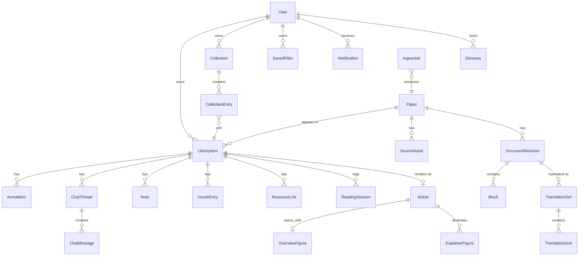

# 01. ドメインモデル

> 入力形式(LaTeX / HTML / PDF)の差異をここで吸収し、翻訳・ビューア・チャット・語彙学習・記事ビュー・リソース添付はすべて共通の「構造化ドキュメント」の上で動く。本書のモデルが崩れると全機能が崩れるため、最初に固める。確定デザイン(画面 1a〜5a)と旧仕様が矛盾する場合はデザインを正とする。

## 1. 設計の要点(ユーザー体験からの逆算)

- 同じ arXiv 論文を複数ユーザーが取り込んだとき、パース・翻訳を使い回せる(コストと待ち時間の大幅削減)。→ **論文実体(グローバル)と個人状態(ライブラリ項目)を分離する。**
- ハイライトやチャットの根拠は、再翻訳やパーサ改良後も壊れてはならない(P4)。→ **注釈は訳文にではなく、原文ブロックの安定 ID に紐づける。**
- arXiv の v1→v2 更新やパーサのバージョンアップで本文が変わりうる。→ **ドキュメントはリビジョン管理し、注釈は旧リビジョンの引用スナップショットを持って移行(リアンカー)する。**
- 語彙・記事・概要図・リソースのメモなど、AI 生成物と個人の学習資産が本文位置を参照する。→ **位置参照はすべて共通のアンカー仕様(§5)に一本化する。**
- 「勝手に消さない・勝手に状態を変えない」(P3・P6)。→ ステータス自動遷移は Notification による**提案**として表現し、適用はユーザー操作で行う。

## 2. エンティティ関係図



## 3. 主要エンティティ

### Paper(グローバル論文実体)
サービス全体で一意。重複検知([02-ingest.md](02-ingest.md))の正規化先。

- 識別子: `paper_id`(内部)、`arxiv_id`(バージョン抜き, 例 `2209.03003`)、`doi`、`pdf_sha256`(アップロード PDF 用)
- 書誌: タイトル、著者リスト、アブストラクト(原文)、発表年月、venue、arXiv カテゴリ、ライセンス(`cc-by-4.0` / `cc-by-nc-sa-4.0` / `arxiv-nonexclusive` / `unknown` など。記事ビューの図転載バッジ「CC BY 4.0 — 転載可」(1h)や共有ページの表示可否判定([09-nonfunctional.md](09-nonfunctional.md))に使う)
- 可視性: `public`(arXiv 等の公開論文。パース・翻訳結果を全ユーザーで共有可)/ `private`(個人アップロード PDF。所有者のみアクセス可。ライブラリでは「PDF 取り込み」バッジ+出典「アップロード」で表示(1e))
- 公式実装候補: arXiv ページのリンクから検出した GitHub リポジトリ URL(ResourceLink の自動提案の源泉。§8)
- サムネイル: 代表図または概要図への参照

### LibraryItem(ユーザー × 論文)
個人の読書状態のすべてを持つ。同一 Paper に対しユーザーごとに 1 つ。

| フィールド | 型・値域 | 出所・備考 |
|---|---|---|
| ステータス | 6値: 読む予定 / すぐ読む / 読んでいる / 読んだ / あとで再読 / 保留 | 色ドット付きで全画面共通表示(1e)。変更はユーザー操作のみ(P6) |
| 優先度 | `high / mid / low`(高 / 中 / 低) | ライブラリ列「優先度」(1e)。高は警告色強調 |
| 締切 | 日付(任意) | 期日が近いと警告色太字(1e)。締切リマインド通知の源泉 |
| タグ | ユーザー内自由語彙(複数) | |
| 追加日時 / 読了日 | 読了日は「読んだ」変更時に自動記録(1g) | |
| 累計読書時間 | ReadingSession の集計。自動記録・編集 UI なし(1g) | |
| 進捗率 | 読書位置から導出(%) | 「§2.1 · 42%」(4b)、拡張の「続きから開く」等に表示。**決定:** 保存値ではなく読書位置由来の導出値とする(進捗の二重管理を避け、P6「読む行動から育つ」に合わせるため) |
| 理解度 | 1–5(任意) | 読了フロー(1g)で入力。「4/5 — だいたい追えた」形式のラベル付き |
| 重要度 | `low / mid / high`(低 / 中 / 高、任意) | 読了フロー(1g)のセグメント選択。旧仕様の 1–3 数値から変更(デザイン準拠) |
| 読書位置 | `document_revision + block_id + 表示モード` | 「続きを読む」「前回位置」の源泉 |
| ひとことメモ | 1行テキスト | 読了フローの「ひとことメモ — 何に使えるか」(1g)。本文メモは Note |

クイックフィルタの「未読 / 途中 / 読了 / 要再確認」(1e)は保存値ではなく、ステータスからの**派生分類**(未読=読む予定+すぐ読む、途中=読んでいる+保留、読了=読んだ、要再確認=あとで再読。[06-library.md](06-library.md) §1 と同一定義。1e の件数例 12+4+23+2=41 が総数と一致するとおり、6 ステータスすべてがいずれか 1 分類に属する)。

### SourceAsset(取得した原データ)
`kind: arxiv_latex | arxiv_html | pdf | metadata_api | extension_capture`。取得日時・取得元 URL・バイト列(オブジェクトストレージ)・ソースバージョン(arXiv `v2` 等)を保持する。再パース(品質レベル昇格 B→A)の原資となるため、原データは破棄しない。

### DocumentRevision(構造化ドキュメントのリビジョン)
`(paper_id, source_version, parser_version)` ごとに 1 リビジョン。パーサ改良や arXiv 更新で新リビジョンが作られ、旧リビジョンは注釈移行が完了するまで残す。

- `quality_level: A | B` — **2値**([02-ingest.md](02-ingest.md))。A=LaTeX ソースから完全構造化(2a の説明文「LaTeX ソースから完全構造化。数式・相互参照・図表・脚注を保持しています。」)、B=PDF 由来(通常解析または OCR)。バッジで常時明示(1e・2a・5a ほか)。旧 A〜D 4段階は廃止し C/D は B に統合する
- `sections[]`: 見出しツリー。各セクションが `blocks[]` を持つ
- PDF 由来の場合、各ブロックに `page + bbox`(原紙面上の位置)を持ち、PDF モードの相互リンク「同期: p.5 ≒ §2.2」(2a)を支える

## 4. 構造化ドキュメントモデル(中間表現)

すべてのパーサ(LaTeX / HTML / PDF)の出力仕様であり、翻訳・表示・チャット文脈・記事ビュー生成の入力仕様である。

### 4.1 Block(ブロック)

| type | 内容 | 備考 |
|---|---|---|
| `paragraph` | インライン列 | 翻訳対象の基本単位 |
| `heading` | レベル(1–4)、番号、タイトル | 訳出時は原題併記(例「3.1 CIFAR-10 画像生成 — Unconditional Image Generation」(5a)) |
| `figure` | 画像アセット参照、キャプション(インライン列)、`label`(例 `fig:overview`) | キャプションは翻訳対象 |
| `table` | セル構造(HTML 相当)またはレンダリング画像+キャプション | セル内テキストの翻訳は任意設定 |
| `equation` | LaTeX 文字列、数式番号、`label` | 翻訳しない。KaTeX 描画 |
| `code` | 言語、コード文字列 | 翻訳しない |
| `list` | 順序有無、項目(各項目はインライン列) | |
| `quote` / `theorem` / `algorithm` | 種別付きの段落コンテナ | theorem 類は種別名(定理・補題)を訳す |
| `footnote` | 本文アンカーと内容 | 翻訳対象 |
| `reference_entry` | 参考文献 1 件の書誌 | 翻訳しない。構造化(著者・年・タイトル・リンク)を試み、「+この論文も取り込む」導線(1c)に使う |

品質 B(PDF 由来)のブロックは追加で `page` / `bbox` を持つ。

### 4.2 Inline(インライン)

`text` / `math_inline`(LaTeX)/ `citation`(→ reference_entry)/ `ref`(→ figure・table・equation・section の label)/ `footnote_ref` / `url` / `emphasis` / `code_inline`。

翻訳時、`text` 以外のインラインはプレースホルダ化して保護する([03-translation.md](03-translation.md))。

### 4.3 ブロック安定 ID

- 生成規則: `セクションパス + ブロック種別 + セクション内出現順 + 内容ハッシュ(先頭64bit)` から決定的に生成する。
- 新リビジョン作成時、旧リビジョンのブロックと `内容ハッシュ一致 → 前後関係 → 編集距離` の順で対応付け、一致したブロックは **同じ ID を引き継ぐ**。これにより注釈・翻訳キャッシュの大部分が無傷で移行する。
- 対応が取れない注釈は「引用スナップショット」(下記)による文字列探索でリアンカーし、それも失敗したら「未配置」の注釈として一覧に退避する(黙って消さない。P3。1b の注釈一覧に「未配置 0件」表示)。

### 4.4 ドキュメント JSON 例(抜粋)

```json
{
  "revision_id": "rev_01H...",
  "quality_level": "A",
  "sections": [{
    "id": "sec-3",
    "heading": {"number": "3", "title": "Method"},
    "blocks": [
      {"id": "blk-3-p2-a1f9", "type": "paragraph",
       "inlines": [
         {"t": "text", "v": "We train the model with "},
         {"t": "citation", "ref": "ref-12"},
         {"t": "text", "v": " using the loss in "},
         {"t": "ref", "kind": "equation", "ref": "eq-5"},
         {"t": "text", "v": "."}
       ]},
      {"id": "blk-3-eq5-77c2", "type": "equation",
       "latex": "\\mathcal{L} = ...", "number": "5", "label": "eq:loss"}
    ]
  }]
}
```

## 5. アンカー仕様

注釈・チャット根拠・語彙エントリ・記事内引用・リソースのひとことメモが共通で使う位置参照。

```
Anchor {
  revision_id,          # 作成時のドキュメントリビジョン
  block_id,             # ブロック安定ID
  start, end,           # 原文テキスト上の文字オフセット(ブロック内)。ブロック全体参照なら null
  quote,                # 選択テキストのスナップショット(最大500字)— リアンカー・表示用
  side                  # source | translation — どちらの面で作られたか(表示に使う)
}
```

- **訳文上で選択して作った注釈も、対応する原文ブロックに紐づける**(訳文は再生成で変わりうるため)。訳文側オフセットは補助情報として持つが、正は原文側。
- 根拠ジャンプ([05-chat.md](05-chat.md))はアンカーを受け取り、ビューアの該当ブロックへスクロール+一時ハイライトする。粒度はセクション(§2.2)から段落(¶2)まで(1a のチップ「§2.2 ¶3」)。
- 表示用の短縮表記(「§2.1」「表1」「§2.2 ¶3」)はアンカーから決定的に導出する。記事の根拠チップ・語彙の「原文で見る →」・リソースメモの「§2.2」チップはすべてこの表記の UI 差分にすぎない。

## 6. 翻訳モデル

```
TranslationSet {
  revision_id, style,        # style: natural | literal | easy(「スタイル: 自然訳」切替, [03-translation.md](03-translation.md))
  glossary_snapshot_id,      # 適用した用語集の凍結スナップショット
  scope: shared | personal,  # 共有キャッシュ or 個人フォーク
  status: pending | partial | complete
}
TranslationUnit {
  set_id, block_id,
  source_hash,               # 原文ブロックのハッシュ。原文が変われば無効化
  text_ja,                   # プレースホルダ復元済みの訳文(インライン構造を保持)
  state: machine | edited | protected,  # edited/protected は再翻訳で上書きしない
  quality_flags[]            # placeholder_mismatch 等の自動検査結果
}
```

## 7. VocabEntry(語彙エントリ)— 英語学習

訳語統一の用語集(Glossary)とは**別物**。本文で選択→「語彙に追加」(1b の選択メニュー)で文脈ごと保存される英語学習資産。UI と学習フローは [11-vocabulary.md](11-vocabulary.md)。

```
VocabEntry {
  library_item_id,           # 出典論文(ユーザー資産)
  kind: word | collocation | idiom,   # 「単語 / コロケーション / イディオム」の3分類(4d)
  term,                      # 見出し語(例 "boil down to")
  pos_label,                 # 品詞・分類ラベル(例 「句動詞」)。保存時にAI生成・編集可(生成由来/編集済みフラグを持つ)
  ipa,                       # IPA発音(例 /ˌbɔɪl ˈdaʊn tə/)。保存時にAI生成・編集可(同上)
  context_anchor,            # 文脈センテンスのアンカー(§5)。「原文で見る →」の遷移先
  context_sentence,          # 原文センテンスのスナップショット+対象語のハイライト範囲
  created_at,
  ai: {                      # 保存時に文脈からAI自動生成。各フィールドに editable フラグ
    context_meaning,         #「文脈での語義」(一覧用の短形+詳細用の長形)
    interpretation,          #「解釈のしかた」(句動詞分解などの読み方解説)
    etymology,               #「語源メモ」
    mnemonic,                #「✦ 覚えるコツ」
    related_expressions,     #「よく出る形・近い表現」
    is_ai_generated, edited  # 「AI生成 · 編集可」バッジ(4d)の状態表示に対応
  },
  srs: {                     # 忘却曲線ベースの復習(SRS)
    next_review_at,          # 「次の復習: 明日(2 回目)」
    review_count,
    interval_days,
    history[]                # 自己評価の履歴: again(「まだあやしい」) | good(「✓ 覚えた」) + 日時
  }
}
```

- 「語義・語源・コツは保存時に文脈から自動生成されます(編集可)· 復習は忘却曲線に沿って出題」(4d フッタ)が仕様の要約。AI 生成フィールドはユーザー編集後も `is_ai_generated` を保持し、編集済みフラグを立てる(再生成時に上書きしない。P3 と同思想)。
- `srs.next_review_at <= now` が「復習期」フィルタと「復習をはじめる」ボタンの件数バッジの判定条件。

## 8. ResourceLink(外部リソース)— 新設

論文に GitHub 実装・発表動画・スライド・解説記事をひも付ける(5a)。UI とふるまいは [12-resources.md](12-resources.md)。

```
ResourceLink {
  library_item_id,
  kind: github | youtube | slides | article,   # URL貼り付けで自動判定(「URL を貼り付け — 種類を自動判定」)
  url,
  official: bool,            # 「公式実装」バッジ(GitHub のみ)
  title, thumbnail,          # 自動取得(「タイトルとサムネイルは自動取得」)
  meta: {                    # 種類別メタ(自動取得)
    github:  { repo, language, stars, updated_at },   # 「GitHub · Python · ★ 1.2k · 更新 2023-11」
    youtube: { duration, attribution },               # 「YouTube · 12:34 · 著者発表」
    slides:  { domain, format, pages },               # 「iclr.cc · PDF · 24 枚」
    article: { domain, label, reading_time }          # 「zenn.dev · 解説記事 · 15 min」
  },
  note,                      # ひとことメモ(任意)。アンカー参照チップ(例 「§2.2」)を埋め込み可
  created_at
}
```

- **所有:** ResourceLink は LibraryItem(ユーザー × 論文)に属する。**決定:** ひとことメモが個人の読解メモであり、デザイン上も個人ワークベンチのサイドパネル内にあるため、Paper 共有資産にはしない。
- **公式実装の自動提案:** Paper の arXiv メタデータから検出した公式実装候補(「✦ 公式実装を検出しました — arXiv ページのリンクから」)は、破線カードの提案状態 `suggested` として表示し、「+ 追加」で確定 ResourceLink(`official: true`)、「無視」で `dismissed` にする。提案の却下は LibraryItem ごとに記録する(再表示しない)。
- サイドパネル「リソース」タブの件数バッジ(例 4)は確定リソース数(提案中は含めない)。

## 9. Article(記事ビュー)— 再定義

旧仕様の「ブロックエディタで編集する複数記事+公開機能」は廃止。**記事はビューアの表示モードの 1 つ**であり、「訳文・メモ・チャット履歴から自動構成」(1h メタ行)される読み返し用の個人資産。**論文 × ユーザーで 1 つ**。生成・再生成の仕様は [07-figures-and-articles.md](07-figures-and-articles.md)。

```
Article {
  library_item_id,           # 1:0..1(初回生成まで存在しない)
  title,                     # AI生成の日本語タイトル
  version, generated_at,     # 版管理。「✦ 指示つき再生成」で新しい版を作る
  sections[] {               # セクション/ブロック構造
    blocks[] {
      type: heading | paragraph | quote_source | figure_embed | discussion | attribution,
      content,
      evidence_anchors[],    # 根拠チップ(「§1」「§2.2」「表1」「§2.2 ¶3」)→ §5 Anchor
      origin                 # ai | user_highlight(「あなたの疑問ハイライトから」バッジ)
    }
  },
  instructions_history[]     # ブロック単位/全体の「✦ 書き直し指示」の履歴(再生成の入力)
}
```

- 素材は訳文・メモ・チャット履歴。免責文言「元の論文とは別物です — 根拠チップから原文へ」を常時表示する(P1)。
- `quote_source` は原文引用ブロック(英語原文+位置チップ+「原文で見る →」)。`figure_embed` は原論文図の転載で、ライセンスバッジと「クレジット自動付記」を伴う(Paper のライセンスから導出)。`attribution` は末尾の出典ブロックで「自動挿入 · 削除不可」。
- `discussion` は「議論したい点」。項目ごとに由来(AI 発案 / ユーザーの疑問ハイライト由来)を持つ。
- **公開は別エンティティ ArticlePublication に切り出す**(下記)。Article 本体は個人の読み返しビューのままで、公開時はサニタイズ済みスナップショットを別行に持つ。共有経路はコレクション共有ページ([06-library.md](06-library.md))と記事公開の 2 系統。

### ArticlePublication / PublicationComment(記事公開)— 実装済み

記事のサニタイズ済み公開スナップショット。P7 整合として原文引用本文・原論文図・訳文・メモ・チャット・discussion を含めない([07-figures-and-articles.md](07-figures-and-articles.md) §2.8)。

```
ArticlePublication {
  article_id,                # 1記事につき1公開(UNIQUE)
  user_id,
  slug,                      # 認証不要の公開 URL /p/{slug}(UNIQUE)
  visibility: unlisted | public | private,  # unlisted=noindex / public=索引可 / private=公開解除後の slug 予約状態
  snapshot_version,
  title, paper_meta,         # 論文タイトル・書誌(公開表示用の最小情報)
  blocks,                    # 許可リストのブロックのみ(heading/paragraph/attribution/overview_figure/explainer_figure)
  published_at
}
PublicationComment {
  publication_id, block_id,  # 公開記事のブロック単位に紐づく
  author, body, created_at   # 論文ページへの公開ディスカッション(alphaXiv 型)ではない
}
```

- **private 論文の記事は公開不可**。公開解除しても行は残し slug を予約する(リンク乗っ取り防止)。

## 10. OverviewFigure / ExplainerFigure(概要図・解説図)

生成パイプラインの詳細は [07-figures-and-articles.md](07-figures-and-articles.md)。データモデル上は二本立て:

### OverviewFigure(全体概要図)
記事ビュー冒頭の 課題→提案→結果 の 3 カードフロー図(1h)。**構造化図データ(JSON DSL)を正とし、SVG を決定的にレンダリングする**(「SVG ⤓」ダウンロードと 100% 同一デザイン要件のため。ラスター生成ではテキスト破綻・再現性の問題がある)。

```
OverviewFigure {
  article_id,
  version, generated_at,     # 「AI生成 · 版 2」。書き直し指示ごとに版が進む
  dsl,                       # 構造化図データ(カード: 種別ラベル/見出し/本文/強調色、コネクタ)
  evidence_anchors[],        # フッタの「根拠:」チップ(§1 / §2.2 / 表1)
  instructions_history[]     # 「✦ 書き直し指示」の履歴
}
```

**決定:** OverviewFigure は Article に属する(Paper 直下ではない)。素材(メモ・チャット)と書き直し指示が個人のものであり、デザイン上も記事ビュー内の要素であるため。

### ExplainerFigure(詳細解説図)
記事に挿し込む追加の解説図・挿絵。**画像生成 API(GPT / Gemini / Grok)産のラスター画像**。

```
ExplainerFigure {
  article_id,
  provider, model,           # 生成に使った ImageProvider(gpt-image系 / Gemini画像 / Grok imagine)
  prompt,                    # 生成プロンプト(重要テキストはキャプション側に持つ方針。[07])
  version, image_asset,      # 版管理+オブジェクトストレージ参照
  caption, evidence_anchors[]
}
```

概要図のラスター生成モード(設定で切替)を使った場合も、生成結果は ExplainerFigure と同じ `provider / prompt / version` を記録する。

## 11. コレクション・保存フィルタ・通知

### Collection / CollectionEntry
手動キュレーションの順序付きリスト(4b)。1 論文は複数のコレクションに入れられる。

```
Collection {
  user_id, name,
  description,               # 自由記述。「説明を編集」でインライン編集
  deadline,                  # 締切日。「締切 7/16 — 残り 10 日」表示、サイドバーにミニバッジ
  share: {                   # 閲覧用共有リンク(共有ページは 4c)
    token,                   # 8文字英数(例 alinea.app/c/x8Kf3qPw)
    status: none | active | revoked,   # 「発行済み」/「リンクを無効化」
    include_notes: bool      # 「共有ページにメモを含める」トグル(ON時は対象メモ件数を表示)
  }
}
CollectionEntry {
  collection_id, library_item_id,
  order,                     # 表示順。「発表順 — ドラッグで並べ替え」。並び順は共有ページにも反映
  assignee,                  # 担当メンバー名(自由テキスト。例 「自分」「佐藤」)。グループ機能ではない
  presentation_minutes,      # 発表時間メタ(例 「発表 25 分」。任意)
  note                       # 予備注記(例 「予備(時間があれば)」。任意)
}
```

- 読了進捗バー「3/5 読了」は Collection 内 LibraryItem のステータス集計(導出値)。
- `assignee` は文字列であり User 参照ではない。**決定:** 確定デザインは輪読会メンバーのアカウント連携を持たない(Q4: グループ機能はスコープ外)ため、表示用の名前のみ持つ。

### SavedFilter(保存フィルタ)
ライブラリの「この条件を保存」(1e)で作られ、サイドバー「保存フィルタ」(例 「締切あり」「cs.CV の未読」)に件数付きで並ぶ。

```
SavedFilter {
  user_id, name,
  conditions,                # 属性フィルタ(ステータス/タグ/コレクション/品質/年)+クイックフィルタ分類
  sort                       # 並び条件(例 更新日)
}
```

件数はクエリ実行時の導出値(保存しない)。

### Notification(通知)
ヘッダの通知アイコン(◷)+ポップオーバー(4a)。3 種のみ。

```
Notification {
  user_id,
  kind: translation_complete | status_suggestion | deadline_reminder,
  payload,                   # 対象 LibraryItem / Collection、提案内容(遷移先ステータス等)
  read: bool,                # 未読ドット。「すべて既読にする」で一括更新
  created_at
}
```

- `translation_complete`: 全文翻訳完了。「読み始める →」導線。
- `status_suggestion`: 読書行動からのステータス変更提案。「変更する · そのまま」の2択で、**適用はユーザー操作のみ**(P6)。設定「ステータス自動遷移 = 自動適用 / 提案する(既定)/ 提案しない」が生成条件を制御([06-library.md](06-library.md))。
- `deadline_reminder`: コレクション/論文の締切リマインド。

## 12. その他のエンティティ(要点のみ)

- **Annotation**: `kind: highlight | comment | bookmark`、色(意味別4色: 重要 / 疑問 / アイデア / 用語, [04-viewer.md](04-viewer.md))、Anchor、本文(comment のみ)、作成日時。未配置状態(リアンカー失敗)を持つ。
- **Note**: LibraryItem ごとの Markdown メモ(複数可)。チャットからの昇格時(「↑メモに保存」「✦ 要約をメモに保存」)は元メッセージとアンカーへの参照を保持。
- **ChatThread / ChatMessage**: スレッド切替(メイン+派生)。メッセージは `role`、本文、`context_anchors[]`(選択質問の対象)、`evidence_anchors[]`(回答の根拠。¶ 粒度まで)、「論文外の知識」区分を持つ([05-chat.md](05-chat.md))。
- **Glossary / Term**: 訳語統一の用語集。3層(グローバル既定・ユーザー・論文ローカル)。Term は `原語, 訳語, 品詞/種別, 訳し方(訳す|原語のまま|併記)`。VocabEntry(§7)とは独立。
- **IngestJob / TranslationJob**: 非同期ジョブ。段階(`stage`)、進捗、失敗理由、リトライ回数。拡張のパイプライン表示(書誌✓→構造化✓→翻訳中%, [08-extension.md](08-extension.md))と 2a の取り込みタイムラインの裏付け。
- **ReadingSession**: ビューア滞在の実測(開始・終了・アクティブ秒数)。累計読書時間・統計・ステータス提案の源泉。設定「読書時間計測 ON/OFF」に従う。

## 13. データの所有と削除

- LibraryItem 以下(注釈・メモ・チャット・語彙・リソース・記事・概要図/解説図・セッション)はユーザーの所有物であり、アカウント削除時にすべて削除する。
- Paper / DocumentRevision / 共有 TranslationSet はサービス側の共有資産(public 論文のみ)。個人アップロード PDF 由来の Paper はユーザー削除に連動して削除する。
- コレクション共有トークンはアカウント削除・「リンクを無効化」で失効する。共有ページは `include_notes` が ON のメモ以外の個人資産を一切露出しない(閲覧のみ · アカウント不要 · noindex)。
- エクスポート(P5): メモ・注釈・チャット履歴は Markdown、書誌は BibTeX / CSV、全量は JSON で一括エクスポートできる([06-library.md](06-library.md))。

## 受け入れ基準

- [ ] `quality_level` が A / B の2値で定義され、A=LaTeX 完全構造化 / B=PDF 由来の意味と常時バッジ表示が明記されている
- [ ] LibraryItem に 進捗率(導出)・理解度 1–5・重要度 低/中/高・優先度 高/中/低・6値ステータスが揃い、クイックフィルタ分類が派生値であることが明記されている
- [ ] ResourceLink が kind 4種・official フラグ・自動取得メタ(種類別)・アンカーチップ入りひとことメモ・自動検出提案の状態遷移(suggested → 追加/無視)を持つ
- [ ] VocabEntry が 3分類・文脈センテンス+アンカー・AI生成フィールド(語義/解釈/語源/コツ/よく出る形の5つ+IPA・分類ラベル。いずれも編集可フラグ付きで、編集済みは再生成で上書きしない)・SRS(next_review_at / review_count / interval / 自己評価履歴)を持つ
- [ ] Notification が 3種+既読フラグで定義され、ステータス提案が「適用はユーザー操作のみ」であることが明記されている
- [ ] SavedFilter が 名前+条件+ソート で定義され、件数が導出値であることが明記されている
- [ ] Collection に 説明・締切・共有トークン(発行/無効化)・「共有ページにメモを含める」フラグ、CollectionEntry に order / assignee / 発表時間 / 予備注記 がある
- [ ] Article が「論文×ユーザーで1つ・AI自動構成・版管理・根拠アンカー付きブロック構造」で定義され、公開は別エンティティ ArticlePublication(slug・visibility 3値・サニタイズ済み blocks)+ PublicationComment として定義されている
- [ ] OverviewFigure(JSON DSL+SVG決定的レンダリング+版管理)と ExplainerFigure(画像生成API産ラスター+provider/prompt/version記録)が区別されている
- [ ] ER 図に ResourceLink / Notification / SavedFilter / Article(LibraryItem 1:0..1)/ OverviewFigure / ExplainerFigure が含まれている
- [ ] すべての位置参照(注釈・チャット根拠・語彙・記事引用・リソースメモ)が §5 の Anchor に一本化されている
