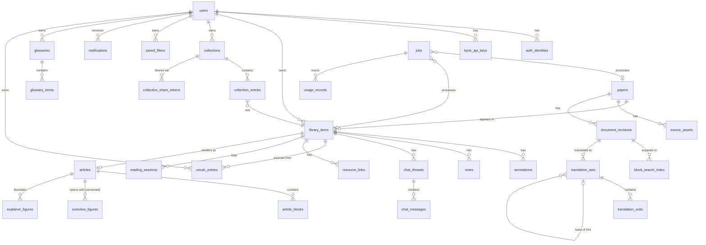

# 02. データモデル実装計画 — PostgreSQL 16 完全 DDL

> 対象読者と前提
> 本書は「訳読 / YAKUDOKU — 論文読解ワークベンチ」のデータベース実装計画である。対象読者はバックエンド実装者(apps/api・apps/worker)。機能仕様の正は /docs(特に [docs/01-domain-model.md](../docs/01-domain-model.md)・[docs/09-nonfunctional.md](../docs/09-nonfunctional.md))であり、本書は docs の全エンティティを PostgreSQL 16 + PGroonga の DDL として確定させる。技術スタックは spec-decisions C 項(PostgreSQL 16 + PGroonga / SQLAlchemy 2 + Alembic / Redis 7 + arq / S3 互換ストレージ)を前提とする。本書の DDL は §4 を上から順に実行すればそのまま流せる(= Alembic 初期マイグレーションの内容)。

## 1. 全体方針(確定事項)

### 1.1 スキーマ規約

- **主キー**: 原則 `id UUID DEFAULT gen_random_uuid()`。ただし挿入頻度が高く順序性が有用な明細系(`translation_units` / `chat_messages` / `block_search_index` / `notifications` / `reading_sessions` / `usage_records` / `article_blocks`)は `BIGINT GENERATED ALWAYS AS IDENTITY`。
  - 決定: UUIDv4(`gen_random_uuid()`、PostgreSQL 13+ 組み込み)を使う。理由: API で ID を露出するため推測不能性が必要で、拡張なしで生成できる。
- **タイムスタンプ規約**: 全テーブルに `created_at TIMESTAMPTZ NOT NULL DEFAULT now()`。ユーザー操作・再生成で更新されるテーブルには `updated_at TIMESTAMPTZ NOT NULL DEFAULT now()` を持たせ、共通トリガ関数 `set_updated_at()`(§4.1)で自動更新する。決定: `updated_at` を持たない(=トリガも張らない)テーブルは次の 11 個に確定する: `auth_identities` / `source_assets` / `document_revisions` / `block_search_index` / `chat_messages`(streaming→complete の状態更新はあるが履歴上 `created_at` で足りる)/ `notifications` / `collection_share_tokens`(revoke 時刻は `revoked_at`)/ `overview_figures` / `explainer_figures` / `reading_sessions` / `usage_records`。それ以外の全テーブルは `updated_at` +トリガを持つ(§4 の DDL が正)。
- **列挙値**: **PostgreSQL ENUM 型は使わず、`TEXT` + `CHECK` 制約で表現する**。決定理由: (a) Alembic での値追加が `ALTER TYPE ... ADD VALUE`(トランザクション制約あり)ではなく制約の張り替えで済み、ダウングレードも書ける。(b) Pydantic v2 / TypeScript の文字列リテラル型とそのまま一致する。(c) 本プロダクトの列挙は「6値ステータス」など仕様確定済みで、性能面の ENUM の利点(4バイト)が問題になる規模ではない。
- **外部キー**: すべて `REFERENCES ... ON DELETE <動作>` を明示。既定は `CASCADE`(所有関係)。参照が切れても行を残すべき箇所のみ `SET NULL`。
- **命名**: テーブル=複数形スネークケース。インデックス= `ix_<table>_<cols>`、一意= `uq_<table>_<cols>`、部分一意= `uq_<table>_<cols>_<cond>`、CHECK= `ck_<table>_<name>`、FK= `fk_<table>_<col>`、PGroonga= `pgroonga_<table>_<col>`。
- **JSONB スキーマ**: DB に JSONB で持つ構造(アンカー・ドキュメント本体・記事ブロック内容など)は §3 に完全定義し、Pydantic v2 モデル(`apps/api/src/yakudoku_api/schemas/jsonb/`)でアプリ層検証する。DB 側は `jsonb_typeof` レベルの CHECK のみ(深い検証を SQL でやらない。マイグレーション地獄を避けるため)。

### 1.2 blocks の格納方式(最重要決定)

**決定: Block は独立テーブルにせず、`document_revisions.content`(JSONB)内に格納する。検索・アンカー実在検証・PDF 相互リンク用に、非正規化テーブル `block_search_index` へ展開する。**

理由:

1. **読み出し単位がリビジョン丸ごと**: ビューア初期表示([docs/04-viewer.md](../docs/04-viewer.md))は常に構造化ドキュメント全体を必要とし、ブロック単位の部分取得ユースケースがない。JSONB 1 行の読み出しは数百行の JOIN 復元より速く単純。
2. **ブロックは不変**: リビジョン内でブロックは更新されない([docs/01-domain-model.md](../docs/01-domain-model.md) §3 — 変更は常に新リビジョン)。行単位の更新・ロックが不要なデータを行に分解する利点がない。
3. **パーサ出力との同型性**: パーサ(apps/worker)の出力仕様は docs/01 §4.4 の JSON。そのまま保存すれば「パーサ出力=保存形」となり、シリアライズ層のバグ余地が消える。
4. **行数の抑制**: 1論文 300〜800 ブロック × リビジョン(parser_version 更新ごと)× 全論文で、blocks テーブルは容易に数千万行になる。JSONB 格納なら document_revisions は論文×リビジョン数の行で済む。
5. 一方、**全文検索(PGroonga)・根拠チップの実在検証([docs/05-chat.md](../docs/05-chat.md) §5)・PDF の page+bbox 逆引き(2a)** は「ブロック単位の行」を必要とする。そこで `block_search_index` を**再生成可能な派生テーブル**(正は content JSONB)として展開する。展開は構造化ジョブの最終段で行い、`(revision_id, block_id)` 一意。

### 1.3 論理削除方針

**決定: 論理削除(soft delete)は導入しない。物理削除+FK カスケードで実装する。** docs/01 §13「データの所有と削除」に整合:

- `users` の行削除で、`library_items` 以下の個人資産(注釈・メモ・チャット・語彙・リソース・記事・概要図/解説図・読書セッション・通知・保存フィルタ・コレクション・BYOK キー)がすべて FK カスケードで消える。ログインセッションは DB ではなく Redis(`session:{sid}`。plans/03 §1.3)にあり、アカウント削除ジョブ(`jobs.kind='account_delete'`)が全セッションを即時失効させる(plans/03 §2.8)。
- `papers.owner_user_id` は private 論文(アップロード PDF 由来)のみ NOT NULL で `ON DELETE CASCADE` — アカウント削除で private Paper とその配下(source_assets / document_revisions / translation_sets)も消える。public 論文(`owner_user_id IS NULL`)は共有資産として残る。
- コレクション共有トークンは `collections` のカスケードで消える(=リンク失効)。「リンクを無効化」は `status='revoked'` への更新(削除ではなく履歴として残す。再発行は新規行)。
- UI 上の「削除→元に戻す」トースト([docs/12-resources.md](../docs/12-resources.md) §7、[docs/11-vocabulary.md](../docs/11-vocabulary.md) §6.3)は**フロントエンドの遅延実行**(トースト表示中は DELETE リクエストを保留し、「元に戻す」でキャンセル)で実現する。DB に削除済み行を残さない。

### 1.4 共有翻訳キャッシュのスコープ表現

[docs/03-translation.md](../docs/03-translation.md) §8 の共有/個人フォークを次の形で表現する:

- `translation_sets.scope` = `'shared'` | `'personal'`。
- **shared**: `user_id IS NULL`。「public 論文 × スタイル × グローバル既定用語のみ」の組合せで、`(revision_id, style)` に部分一意制約。自然訳・直訳の両方が shared になり得る(直訳は誰かが初回オンデマンド生成した時点で shared 行が作られる)。
- **personal**: `user_id NOT NULL` + `base_set_id` に共有セットへの参照(private 論文はベースなし= `base_set_id IS NULL`)。`(revision_id, style, user_id)` に部分一意制約。**フォークは差分のみ保持する**: `translation_units` はフォークで再翻訳・手動編集された block の行だけを持ち、表示時は `personal の unit → base(shared)の unit` の順で解決する(アプリ層のマージ。SQL は §5.2 参照クエリ例)。
- private 論文は常に personal(`base_set_id IS NULL`、全 unit を自前保持)。CHECK 制約で「shared には user_id がない」ことを DB レベルで保証する。
- 用語スナップショットは `translation_sets.glossary_snapshot`(JSONB、§3.4)として**セット内に凍結格納**する。決定: 別テーブル(glossary_snapshots)は作らない。理由: スナップショットは不変・セットと 1:1 で、参照も翻訳ジョブからのみ。行として正規化する利点がない。

### 1.5 導出値(保存しない値)の確認

docs が「導出値」と定めたものは**カラムを持たない**(二重管理禁止):

| 導出値 | 導出元 | 参照仕様 |
|---|---|---|
| 進捗率(%) | `library_items.reading_position` とリビジョンのブロック総数から計算 | docs/01 LibraryItem |
| クイックフィルタ分類(未読/途中/読了/要再確認) | `status` からの合成(未読=planned+up_next / 途中=reading+on_hold / 読了=done / 要再確認=reread) | docs/06 §1 |
| 保存フィルタの件数 | クエリ実行時に COUNT | docs/01 §11 |
| コレクション読了進捗(3/5) | entries → library_items.status 集計 | docs/06 §4.1 |
| 翻訳進捗率(96%) | translation_units 完了数 ÷ 自動翻訳対象ブロック数 | docs/03 §6.1 |
| 語彙帳の復習期件数 | `srs_next_review_on <= CURRENT_DATE AND NOT srs_mastered` の COUNT | docs/11 §7.1 |
| リソースタブ件数バッジ | `resource_links.status='active'` の COUNT(提案は数えない) | docs/12 §5 |

例外として `library_items.total_active_seconds`(累計読書時間)のみ**非正規化キャッシュ**を持つ。正は `reading_sessions` で、セッション終了 API が同一トランザクションで再集計代入する。決定理由: ライブラリテーブル 10 列の 1 つ「読書時間」で毎回全行 SUM するのはソート要求(列ヘッダソート)と相性が悪い。値は常に再計算可能で、二重管理には当たらない(編集 UI が存在しない自動記録値。1g)。

## 2. ER 概略



## 3. JSONB スキーマ定義(アプリ層契約)

DDL 中の JSONB カラムの中身。Pydantic モデル名を併記する(apps/api と apps/worker で共有)。

### 3.1 Anchor(共通位置参照 — docs/01 §5)

型名: `AnchorJson`。注釈・チャット根拠・語彙・記事根拠チップ・リソースメモの §チップ、すべてこの 1 形式。

```json
{
  "revision_id": "0197a3c2-...-uuid",
  "block_id": "blk-3-p2-a1f9",
  "start": 120,
  "end": 158,
  "quote": "the training objective boils down to a least squares regression",
  "side": "source"
}
```

- `start` / `end`: 原文テキスト上の文字オフセット(ブロック内)。ブロック全体参照・セクション参照は両方 `null`。
- `quote`: 最大 500 文字(アプリ層で切り詰め)。リアンカーと表示に使う。
- `side`: `"source"` | `"translation"`。訳文側で作られた場合も `block_id` は原文ブロック(正は原文側)。訳文側オフセットは補助フィールド `translation_start` / `translation_end`(任意、null 可)で持つ。
- 表示用短縮表記(「§2.2 ¶3」「式(5)」「表1」)は保存せず、`block_search_index` の `section_label` / `paragraph_ordinal` / `block_type` から決定的に導出する。

### 3.2 DocumentContent(`document_revisions.content`)

型名: `DocumentContentJson`。docs/01 §4.4 の形式そのまま。トップレベル: `{"quality_level": "A", "sections": [...]}`。Block の `type` は docs/01 §4.1 の 12 種(`paragraph` / `heading` / `figure` / `table` / `equation` / `code` / `list` / `quote` / `theorem` / `algorithm` / `footnote` / `reference_entry`)、Inline の `t` は docs/01 §4.2 の 8 種。品質 B のブロックは `page`(int)/ `bbox`([x0,y0,x1,y1] pt 単位 float 配列)を持つ。

### 3.3 ReadingPosition(`library_items.reading_position`)

型名: `ReadingPositionJson`: `{"revision_id": "...", "block_id": "...", "view_mode": "translation"}`。`view_mode` は `translation | parallel | source | pdf | article` の 5 値([docs/04-viewer.md](../docs/04-viewer.md) §2)。

### 3.4 GlossarySnapshot(`translation_sets.glossary_snapshot`)

型名: `GlossarySnapshotJson`。適用順に平坦化した確定用語列: `[{"source_term": "rectified flow", "target_term": "整流フロー", "policy": "both", "origin": "paper"}, ...]`(`origin`: `global | user | paper`)。shared セットでは `origin` が `global` の項のみ許される(§1.4)。

### 3.5 ChatMessageContent(`chat_messages.content`)

型名: `ChatContentJson`。セグメント配列で「論文外の知識」「推測」ボックス([docs/05-chat.md](../docs/05-chat.md) §6)を構造で持つ:

```json
{"segments": [
  {"type": "text", "md": "損失は **式(5)** の最小二乗回帰である A:0。"},
  {"type": "outside_knowledge", "md": "実装では t を [0,1] から一様サンプリングするのが一般的です。"},
  {"type": "speculation", "md": "著者は暗黙に…と仮定していると考えられる。"}
]}
```

`A:n` は `evidence_anchors[n]` を指すインライン根拠チッププレースホルダ(表示時に「§2.1 ¶4」チップへ展開)。

### 3.6 ResourceMeta(`resource_links.meta`)

型名: `ResourceMetaJson`。kind 別([docs/12-resources.md](../docs/12-resources.md) §3.2): `github` → `{"repo": "gnobitab/RectifiedFlow", "language": "Python", "stars": 1200, "pushed_at": "2023-11-04"}` / `youtube` → `{"duration_seconds": 754}` / `slides` → `{"domain": "iclr.cc", "format": "PDF", "pages": 24}` / `article` → `{"domain": "zenn.dev", "reading_minutes": 15}`。

### 3.7 NotificationPayload(`notifications.payload`)

型名 `NotificationPayloadJson`、kind 別 3 形([docs/06-library.md](../docs/06-library.md) §7):

| kind | payload |
|---|---|
| `translation_complete` | `{"library_item_id": "...", "paper_title": "..."}` |
| `status_suggestion` | `{"library_item_id": "...", "paper_title": "...", "suggested_status": "reading", "reason": "read_3min"}`(`reason`: `read_3min | reached_end | promotion_b_to_a`。B→A 昇格提案(docs/02 §4)もこの kind に載せ、その場合の payload は `{"library_item_id": "...", "paper_title": "...", "reason": "promotion_b_to_a", "action": "promote_revision", "revision_id": "..."}` で `suggested_status` を持たない) |
| `deadline_reminder` | `{"collection_id": "...", "collection_name": "...", "days_left": 10, "unstarted_count": 1}` |

### 3.8 SavedFilterConditions(`saved_filters.conditions` / `sort`)

`conditions`: `{"quick": "unread", "status": ["planned"], "tags": ["distillation"], "collection_id": "...", "quality": "A", "years": [2023]}`(各キー省略可。属性フィルタ 5 種= ステータス/タグ/コレクション/品質/年。1e)。語彙は plans/03 §5.14 の `SavedFilterConditions`(= §5.1 のクエリと同一)に一致させる: `quick` の値域は `all | unread | in_progress | done | recheck`(未読=planned+up_next / 途中=reading+on_hold / 読了=done / 要再確認=reread)。`sort`: `{"key": "updated_at", "order": "desc"}`(`key`: `updated_at | added_at | title | deadline | reading_time | comprehension | priority`、`order`: `asc | desc`)。

### 3.9 OverviewFigureDsl(`overview_figures.dsl`)

型名: `OverviewDslJson`。課題→提案→結果の 3 カードフロー(1h):

```json
{
  "layout": "flow3",
  "cards": [
    {"role": "problem",  "label": "課題",                   "heading": "…", "body": "…"},
    {"role": "proposal", "label": "提案 — RECTIFIED FLOW", "heading": "…", "body": "…", "emphasis": "accent"},
    {"role": "result",   "label": "結果",                   "heading": "…", "body": "…", "emphasis": "green"}
  ],
  "connectors": [{"from": 0, "to": 1}, {"from": 1, "to": 2}]
}
```

SVG レンダラ(packages 側)はこの DSL + デザイントークンから**バイト同一の SVG** を決定的に生成する(docs/09 §8)。

### 3.10 JobLog(`jobs.log`)

`[{"at": "2026-07-02T21:04:12+09:00", "stage": "fetching", "level": "info", "message": "arXiv から LaTeX ソース取得", "detail": {"format": "latex", "bytes": 812345}}]`。情報パネルの「処理ログ」(2a)はこの配列を表示する。フォールバック発生・使用モデルもここに記録する(docs/09 §3.5「処理ログで判別可能」)。

## 4. 完全 DDL

以下を順に実行する(= Alembic リビジョン `0001_initial` の `upgrade()` が `op.execute()` で流す SQL)。

### 4.1 拡張・共通関数

```sql
-- 拡張
CREATE EXTENSION IF NOT EXISTS citext;      -- メールアドレスの大文字小文字非依存一意
CREATE EXTENSION IF NOT EXISTS pgroonga;    -- 日英全文検索(詳細: plans/11-search.md)

-- updated_at 自動更新トリガ関数(全テーブル共通)
CREATE FUNCTION set_updated_at() RETURNS trigger
LANGUAGE plpgsql AS $$
BEGIN
  NEW.updated_at := now();
  RETURN NEW;
END;
$$;
```

### 4.2 認証系: users / auth_identities / byok_api_keys

```sql
CREATE TABLE users (
    id             UUID        PRIMARY KEY DEFAULT gen_random_uuid(),
    email          CITEXT      NOT NULL,
    display_name   TEXT        NOT NULL DEFAULT '',
    avatar_url     TEXT,
    -- 表示・翻訳・計測・チャット・通知などの設定(4f)。キーは plans/09-screens/4f-settings.md 参照。
    -- 例: {"theme":"light","accent":"slate","body_font":"serif","translation":{"style":"natural", ...},
    --      "llm_routing":{"translation":{"provider":"deepseek","model":"deepseek-v4-flash"}, ...}}
    settings       JSONB       NOT NULL DEFAULT '{}',
    created_at     TIMESTAMPTZ NOT NULL DEFAULT now(),
    updated_at     TIMESTAMPTZ NOT NULL DEFAULT now(),
    CONSTRAINT uq_users_email UNIQUE (email),
    CONSTRAINT ck_users_settings_object CHECK (jsonb_typeof(settings) = 'object')
);
CREATE TRIGGER trg_users_updated_at BEFORE UPDATE ON users
    FOR EACH ROW EXECUTE FUNCTION set_updated_at();

-- OAuth(Google/GitHub)+メールリンクの資格情報(C5)
CREATE TABLE auth_identities (
    id               UUID        PRIMARY KEY DEFAULT gen_random_uuid(),
    user_id          UUID        NOT NULL REFERENCES users(id) ON DELETE CASCADE,
    provider         TEXT        NOT NULL,
    provider_subject TEXT        NOT NULL,   -- OAuth の sub / メールの場合は正規化メールアドレス
    email            CITEXT,                 -- プロバイダ側メール(表示用)
    created_at       TIMESTAMPTZ NOT NULL DEFAULT now(),
    CONSTRAINT ck_auth_identities_provider
        CHECK (provider IN ('google', 'github', 'email')),
    CONSTRAINT uq_auth_identities_provider_subject UNIQUE (provider, provider_subject)
);
CREATE INDEX ix_auth_identities_user_id ON auth_identities (user_id);

-- セッションテーブルは持たない(決定)。HTTPOnly セッションクッキー(C5)の実体は
-- Redis `session:{sid}`(JSON: user_id / created_at / last_seen_at、30日スライディング)であり、
-- plans/03 §1.3 を正とする。DB の sessions テーブルは廃止。

-- BYOK API キー(docs/09 §3.5・§4: 暗号化保存・マスク表示・再表示不可)
CREATE TABLE byok_api_keys (
    id            UUID        PRIMARY KEY DEFAULT gen_random_uuid(),
    user_id       UUID        NOT NULL REFERENCES users(id) ON DELETE CASCADE,
    provider      TEXT        NOT NULL,
    -- Fernet トークンとして暗号化した API キー(plans/04 §11.2 が暗号化方式の正)。
    -- マスタキーは環境変数 YAKUDOKU_KEY_ENCRYPTION_SECRET(44文字 urlsafe base64。
    -- カンマ区切り複数指定+MultiFernet でローテーション)。暗号化はアプリ層(cryptography)。
    encrypted_key BYTEA       NOT NULL,
    key_hint      TEXT        NOT NULL,       -- 末尾4文字(マスク表示 "sk-…abcd" 用)
    status        TEXT        NOT NULL DEFAULT 'untested'
                  CHECK (status IN ('untested', 'valid', 'invalid')),  -- 接続テスト結果(plans/04 §11.2)
    last_tested_at TIMESTAMPTZ,               -- 最終接続テスト日時
    created_at    TIMESTAMPTZ NOT NULL DEFAULT now(),
    updated_at    TIMESTAMPTZ NOT NULL DEFAULT now(),
    CONSTRAINT ck_byok_api_keys_provider
        CHECK (provider IN ('openai', 'anthropic', 'google', 'deepseek', 'xai')),
    CONSTRAINT uq_byok_api_keys_user_provider UNIQUE (user_id, provider)
);
CREATE TRIGGER trg_byok_api_keys_updated_at BEFORE UPDATE ON byok_api_keys
    FOR EACH ROW EXECUTE FUNCTION set_updated_at();
```

### 4.3 論文実体: papers / source_assets / document_revisions / block_search_index

```sql
CREATE TABLE papers (
    id                UUID        PRIMARY KEY DEFAULT gen_random_uuid(),
    -- 重複検知キー(docs/02 §6。いずれも NULL 可、部分一意)
    arxiv_id          TEXT,                    -- バージョン抜き。例 '2209.03003'
    doi               TEXT,
    pdf_sha256        TEXT,                    -- アップロード PDF 用(hex 64桁)
    -- 書誌
    title             TEXT        NOT NULL,
    authors           JSONB       NOT NULL DEFAULT '[]',  -- [{"name":"Xingchao Liu"},...]
    abstract          TEXT        NOT NULL DEFAULT '',
    abstract_ja       TEXT,                    -- アブスト訳(取り込み時生成。docs/02 §5.2)
    summary_lines     JSONB,                   -- ✦3行要約 ["①…","②…","③…"](共有資産)
    published_on      DATE,
    venue             TEXT,                    -- 例 'ICLR 2023'
    arxiv_categories  TEXT[]      NOT NULL DEFAULT '{}',  -- 例 {cs.LG, cs.CV}
    license           TEXT        NOT NULL DEFAULT 'unknown',
    bib_estimated     BOOLEAN     NOT NULL DEFAULT false,  -- PDF 由来の推定書誌フラグ(plans/05 §9。
                                                           -- Crossref DOI 直一致なら false。「書誌は推定」バッジ+編集フォームの表示条件)
    -- 可視性(docs/01): public=共有資産 / private=アップロード PDF(所有者のみ)
    visibility        TEXT        NOT NULL DEFAULT 'public',
    owner_user_id     UUID        REFERENCES users(id) ON DELETE CASCADE,  -- private のみ NOT NULL
    latest_version    TEXT,                    -- 取得済み最新 arXiv バージョン。例 'v3'
    official_repo_url TEXT,                    -- arXiv ページから検出した公式実装候補(docs/12 §5)
    extracted_terms   JSONB       NOT NULL DEFAULT '[]',  -- 論文ローカル用語の自動抽出結果(共有資産。plans/06 §8.6。
                                                          -- LibraryItem 作成時に glossaries(scope='paper') へコピーする源)
    thumbnail_key     TEXT,                    -- オブジェクトストレージキー(自動選定サムネ)
    latest_revision_id UUID,                   -- FK は document_revisions 作成後に付与(下記 ALTER)
    created_at        TIMESTAMPTZ NOT NULL DEFAULT now(),
    updated_at        TIMESTAMPTZ NOT NULL DEFAULT now(),
    CONSTRAINT ck_papers_visibility CHECK (visibility IN ('public', 'private')),
    CONSTRAINT ck_papers_license CHECK (license IN (
        'cc-by-4.0', 'cc-by-sa-4.0', 'cc-by-nc-4.0', 'cc-by-nc-sa-4.0', 'cc-by-nd-4.0',
        'cc-by-nc-nd-4.0',                           -- arXiv の選択肢に実在(plans/05 §3.3・§13-3)
        'cc0', 'arxiv-nonexclusive', 'unknown')),   -- docs/09 §5.2 マトリクスの判定キー
    CONSTRAINT ck_papers_private_has_owner
        CHECK (visibility = 'public' OR owner_user_id IS NOT NULL)
);
CREATE UNIQUE INDEX uq_papers_arxiv_id   ON papers (arxiv_id)   WHERE arxiv_id IS NOT NULL;
CREATE UNIQUE INDEX uq_papers_doi        ON papers (doi)        WHERE doi IS NOT NULL;
-- 決定: PDF ハッシュの一意はグローバルではなく (owner_user_id, pdf_sha256) のユーザースコープ。
-- 理由: private PDF は他ユーザーと共有せずユーザーごとに別 Paper を作る(plans/03 §3.3)ため、
-- グローバル一意だと 2 人目の同一 PDF アップロードが制約違反で壊れる(plans/05 §13-2)。
-- 同一ユーザー×同一ハッシュのみ 409(重複検知)。pdf_sha256 を持つのはアップロード PDF 由来
-- (=private、owner_user_id NOT NULL)のみなので owner を先頭に置ける。
CREATE UNIQUE INDEX uq_papers_owner_pdf_sha256
    ON papers (owner_user_id, pdf_sha256) WHERE pdf_sha256 IS NOT NULL;
CREATE INDEX ix_papers_owner_user_id ON papers (owner_user_id) WHERE owner_user_id IS NOT NULL;
CREATE TRIGGER trg_papers_updated_at BEFORE UPDATE ON papers
    FOR EACH ROW EXECUTE FUNCTION set_updated_at();

-- 取得した原データ(docs/01。原資は破棄しない — B→A 昇格・再パースの原資)
CREATE TABLE source_assets (
    id             UUID        PRIMARY KEY DEFAULT gen_random_uuid(),
    paper_id       UUID        NOT NULL REFERENCES papers(id) ON DELETE CASCADE,
    kind           TEXT        NOT NULL,
    source_url     TEXT,                       -- 取得元 URL(extension_capture は NULL)
    source_version TEXT,                       -- arXiv 'v2' 等
    storage_key    TEXT        NOT NULL,       -- S3/MinIO キー(バイト列本体)
    content_type   TEXT        NOT NULL DEFAULT 'application/octet-stream',
    byte_size      BIGINT      NOT NULL DEFAULT 0,
    sha256         TEXT,
    fetched_at     TIMESTAMPTZ NOT NULL DEFAULT now(),
    created_at     TIMESTAMPTZ NOT NULL DEFAULT now(),
    CONSTRAINT ck_source_assets_kind CHECK (kind IN
        ('arxiv_latex', 'arxiv_html', 'pdf', 'metadata_api', 'extension_capture'))
);
CREATE INDEX ix_source_assets_paper_id ON source_assets (paper_id);

-- 構造化ドキュメントのリビジョン(docs/01 §3)。blocks は content JSONB 内(§1.2 の決定)
CREATE TABLE document_revisions (
    id             UUID        PRIMARY KEY DEFAULT gen_random_uuid(),
    paper_id       UUID        NOT NULL REFERENCES papers(id) ON DELETE CASCADE,
    source_version TEXT        NOT NULL DEFAULT 'v1',   -- arXiv バージョン(PDF 由来は 'v1' 固定)
    parser_version TEXT        NOT NULL,                -- 例 'latex-1.0.0' / 'pdf-1.2.0'
    quality_level  TEXT        NOT NULL,                -- A / B の2値(docs/02 §4)
    source_format  TEXT        NOT NULL,                -- どの形式から構造化したか(処理ログにも記録)
    content        JSONB       NOT NULL,                -- DocumentContentJson(§3.2)
    -- 構造化結果メタ。タイムライン2段目「(24p / 図8 / 表4)」(2a)の表示元
    stats          JSONB       NOT NULL DEFAULT '{}',   -- {"pages":24,"figures":8,"tables":4,"blocks":412,"translatable_blocks":388}
    created_at     TIMESTAMPTZ NOT NULL DEFAULT now(),
    CONSTRAINT ck_document_revisions_quality CHECK (quality_level IN ('A', 'B')),
    CONSTRAINT ck_document_revisions_format  CHECK (source_format IN ('latex', 'arxiv_html', 'pdf')),
    CONSTRAINT uq_document_revisions_paper_ver_parser
        UNIQUE (paper_id, source_version, parser_version)
);
CREATE INDEX ix_document_revisions_paper_id ON document_revisions (paper_id);

ALTER TABLE papers
    ADD CONSTRAINT fk_papers_latest_revision
    FOREIGN KEY (latest_revision_id) REFERENCES document_revisions(id) ON DELETE SET NULL;

-- ブロック検索インデックス(§1.2)。content JSONB から再生成可能な派生テーブル。
-- 用途: (a) PGroonga 全文検索(原文側) (b) 根拠チップの実在検証 (c) page+bbox 逆引き
--       (d) アンカー表示表記(§2.2 ¶3)の導出
CREATE TABLE block_search_index (
    id                BIGINT  GENERATED ALWAYS AS IDENTITY PRIMARY KEY,
    revision_id       UUID    NOT NULL REFERENCES document_revisions(id) ON DELETE CASCADE,
    block_id          TEXT    NOT NULL,            -- ブロック安定ID(docs/01 §4.3)
    block_type        TEXT    NOT NULL,            -- docs/01 §4.1 の12種
    section_path      TEXT    NOT NULL,            -- 例 'sec-2/sec-2-2'
    section_label     TEXT    NOT NULL,            -- 表示用 '§2.2'(参考文献は 'References' 等)
    paragraph_ordinal INT,                         -- セクション内の段落番号(¶n)。段落系のみ
    element_label     TEXT,                        -- '式(5)' '図2' '表1' 等(equation/figure/table)
    position          INT     NOT NULL,            -- 文書内出現順(0起点)
    source_text       TEXT    NOT NULL DEFAULT '', -- インライン連結の平文(検索対象)
    in_translation_scope BOOLEAN NOT NULL DEFAULT false,
        -- 自動翻訳スコープ内か(plans/06 §2.1 の判定を物理化。§8.3 影響ブロック検索・
        -- §13.1 進捗分母 SQL が使用。content から再生成可能=派生テーブルの性質は維持)
    page              INT,                         -- 品質Bのみ
    bbox              REAL[],                      -- 品質Bのみ [x0,y0,x1,y1](pt)
    created_at        TIMESTAMPTZ NOT NULL DEFAULT now(),
    CONSTRAINT uq_block_search_index_rev_block UNIQUE (revision_id, block_id),
    CONSTRAINT ck_block_search_index_type CHECK (block_type IN
        ('paragraph','heading','figure','table','equation','code','list',
         'quote','theorem','algorithm','footnote','reference_entry'))   -- 12種
);
CREATE INDEX ix_block_search_index_rev_pos  ON block_search_index (revision_id, position);
CREATE INDEX ix_block_search_index_rev_page ON block_search_index (revision_id, page)
    WHERE page IS NOT NULL;
```

### 4.4 翻訳: translation_sets / translation_units

```sql
CREATE TABLE translation_sets (
    id                UUID        PRIMARY KEY DEFAULT gen_random_uuid(),
    revision_id       UUID        NOT NULL REFERENCES document_revisions(id) ON DELETE CASCADE,
    style             TEXT        NOT NULL DEFAULT 'natural',   -- 自然訳/直訳(docs/03 §5)
    scope             TEXT        NOT NULL DEFAULT 'shared',    -- §1.4 の決定
    user_id           UUID        REFERENCES users(id) ON DELETE CASCADE,  -- personal のみ
    base_set_id       UUID        REFERENCES translation_sets(id) ON DELETE CASCADE,
                                   -- personal フォークの共有ベース(private 論文は NULL)
    glossary_snapshot JSONB       NOT NULL DEFAULT '[]',        -- GlossarySnapshotJson(§3.4)
    prompt_version    TEXT        NOT NULL DEFAULT 'tr-2026-07-06.1',
                                   -- 翻訳プロンプト版(plans/06 §9.1 キャッシュキー記録・§9.3 再現性)
    status            TEXT        NOT NULL DEFAULT 'pending',   -- pending/partial/complete
    created_at        TIMESTAMPTZ NOT NULL DEFAULT now(),
    updated_at        TIMESTAMPTZ NOT NULL DEFAULT now(),
    CONSTRAINT ck_translation_sets_style  CHECK (style IN ('natural', 'literal')),
    CONSTRAINT ck_translation_sets_scope  CHECK (scope IN ('shared', 'personal')),
    CONSTRAINT ck_translation_sets_status CHECK (status IN ('pending', 'partial', 'complete')),
    CONSTRAINT ck_translation_sets_scope_user CHECK (
        (scope = 'shared'   AND user_id IS NULL     AND base_set_id IS NULL) OR
        (scope = 'personal' AND user_id IS NOT NULL)
    )
);
-- 共有キャッシュ: リビジョン×スタイルで全サービス一意(docs/03 §8)
CREATE UNIQUE INDEX uq_translation_sets_shared
    ON translation_sets (revision_id, style) WHERE scope = 'shared';
-- 個人フォーク: リビジョン×スタイル×ユーザーで一意
CREATE UNIQUE INDEX uq_translation_sets_personal
    ON translation_sets (revision_id, style, user_id) WHERE scope = 'personal';
CREATE TRIGGER trg_translation_sets_updated_at BEFORE UPDATE ON translation_sets
    FOR EACH ROW EXECUTE FUNCTION set_updated_at();

CREATE TABLE translation_units (
    id            BIGINT      GENERATED ALWAYS AS IDENTITY PRIMARY KEY,
    set_id        UUID        NOT NULL REFERENCES translation_sets(id) ON DELETE CASCADE,
    block_id      TEXT        NOT NULL,
    source_hash   TEXT        NOT NULL,          -- 原文ブロックの内容ハッシュ(xxhash64 hex)
    content_ja    JSONB       NOT NULL,          -- プレースホルダ復元済みインライン列(docs/03 §4)
    text_ja       TEXT        NOT NULL,          -- 平文(検索・長さ検査用。content_ja から導出)
    state         TEXT        NOT NULL DEFAULT 'machine',   -- machine/edited/protected
    quality_flags TEXT[]      NOT NULL DEFAULT '{}',
        -- 値域: placeholder_mismatch / number_mismatch / length_outlier /
        --       glossary_violation / untranslated(docs/03 §10)
        --       + provider_refusal / context_overflow(plans/06 §16-4。
        --       この 2 つと placeholder_mismatch は API が text_ja: null で返す)
    proposal      JSONB,                          -- ✦再翻訳候補(NULL 可。{text_ja, content_ja, generated_at, model}。
                                                  -- 差分表示→採用で本体へ反映。plans/06 §11・plans/03 §7.6)
    model         TEXT        NOT NULL DEFAULT '',          -- 生成モデルID(処理ログ用)
    created_at    TIMESTAMPTZ NOT NULL DEFAULT now(),
    updated_at    TIMESTAMPTZ NOT NULL DEFAULT now(),
    CONSTRAINT ck_translation_units_state CHECK (state IN ('machine', 'edited', 'protected')),
    CONSTRAINT uq_translation_units_set_block UNIQUE (set_id, block_id)
);
CREATE TRIGGER trg_translation_units_updated_at BEFORE UPDATE ON translation_units
    FOR EACH ROW EXECUTE FUNCTION set_updated_at();
```

### 4.5 用語集: glossaries / glossary_terms(訳語統一 — 語彙帳とは別物)

```sql
-- 3層用語集(docs/03 §7): global(運営) / user / paper(=ユーザー×論文ローカル)
CREATE TABLE glossaries (
    id              UUID        PRIMARY KEY DEFAULT gen_random_uuid(),
    scope           TEXT        NOT NULL,
    user_id         UUID        REFERENCES users(id) ON DELETE CASCADE,          -- scope='user'
    library_item_id UUID,        -- scope='paper'。FK は library_items 作成後に付与(下記 ALTER)
    name            TEXT        NOT NULL DEFAULT '',   -- global 用(例 'ML 定訳シード')
    created_at      TIMESTAMPTZ NOT NULL DEFAULT now(),
    updated_at      TIMESTAMPTZ NOT NULL DEFAULT now(),
    CONSTRAINT ck_glossaries_scope CHECK (scope IN ('global', 'user', 'paper')),
    CONSTRAINT ck_glossaries_scope_refs CHECK (
        (scope = 'global' AND user_id IS NULL     AND library_item_id IS NULL) OR
        (scope = 'user'   AND user_id IS NOT NULL AND library_item_id IS NULL) OR
        (scope = 'paper'  AND user_id IS NULL     AND library_item_id IS NOT NULL)
    )
);
CREATE UNIQUE INDEX uq_glossaries_user  ON glossaries (user_id)         WHERE scope = 'user';
CREATE UNIQUE INDEX uq_glossaries_paper ON glossaries (library_item_id) WHERE scope = 'paper';
CREATE TRIGGER trg_glossaries_updated_at BEFORE UPDATE ON glossaries
    FOR EACH ROW EXECUTE FUNCTION set_updated_at();

CREATE TABLE glossary_terms (
    id          UUID        PRIMARY KEY DEFAULT gen_random_uuid(),
    glossary_id UUID        NOT NULL REFERENCES glossaries(id) ON DELETE CASCADE,
    source_term TEXT        NOT NULL,   -- 原語(例 'rectified flow')
    target_term TEXT        NOT NULL,   -- 訳語(例 '整流フロー')
    pos_label   TEXT        NOT NULL DEFAULT '',   -- 品詞/種別(例 '名詞' '頭字語')
    policy      TEXT        NOT NULL DEFAULT 'translate',  -- 訳し方(docs/03 §7)
    auto_extracted BOOLEAN  NOT NULL DEFAULT false, -- papers.extracted_terms 由来の自動抽出項
                                                    -- (plans/06 §8.6・plans/03 §7.9)
    created_at  TIMESTAMPTZ NOT NULL DEFAULT now(),
    updated_at  TIMESTAMPTZ NOT NULL DEFAULT now(),
    CONSTRAINT ck_glossary_terms_policy CHECK (policy IN ('translate', 'keep_original', 'both'))
        -- translate=訳す / keep_original=原語のまま / both=併記
);
CREATE UNIQUE INDEX uq_glossary_terms_glossary_term
    ON glossary_terms (glossary_id, lower(source_term));
CREATE TRIGGER trg_glossary_terms_updated_at BEFORE UPDATE ON glossary_terms
    FOR EACH ROW EXECUTE FUNCTION set_updated_at();
```

### 4.6 個人ライブラリ: library_items

```sql
CREATE TABLE library_items (
    id                   UUID        PRIMARY KEY DEFAULT gen_random_uuid(),
    user_id              UUID        NOT NULL REFERENCES users(id) ON DELETE CASCADE,
    paper_id             UUID        NOT NULL REFERENCES papers(id) ON DELETE CASCADE,
    -- 6値ステータス(docs/06 §1)
    status               TEXT        NOT NULL DEFAULT 'planned',
    priority             TEXT,                         -- 高/中/低(未設定=NULL、表示は「—」)
    deadline             DATE,
    tags                 TEXT[]      NOT NULL DEFAULT '{}',
    suggested_tags       TEXT[]      NOT NULL DEFAULT '{}',   -- 承認式提案(docs/02 §7)
    one_line_note        TEXT        NOT NULL DEFAULT '',     -- ひとことメモ(1g/3a)
    understanding        SMALLINT,                    -- 理解度 1–5(1g)
    importance           TEXT,                        -- 重要度 低/中/高(1g)
    reading_position     JSONB,                       -- ReadingPositionJson(§3.3)
    queue_order          INT,                         -- 「すぐ読むキュー」の手動順序(1d)。up_next のみ使用。
                                                      -- 決定: status が up_next 以外へ遷移したら API 層で NULL にリセットする
    total_active_seconds BIGINT      NOT NULL DEFAULT 0,  -- reading_sessions の非正規化キャッシュ(§1.5)
    thumbnail_key        TEXT,                        -- 手動差し替え時のみ(NULL=papers.thumbnail_key)
    added_at             TIMESTAMPTZ NOT NULL DEFAULT now(),  -- 追加日(1e 列)
    finished_at          TIMESTAMPTZ,                 -- 読了日。status→'done' 遷移時に自動記録(1g)。
                                                      -- 決定: done から他ステータスへ戻しても保持し、再度 done になったら上書きする
    created_at           TIMESTAMPTZ NOT NULL DEFAULT now(),
    updated_at           TIMESTAMPTZ NOT NULL DEFAULT now(),
    CONSTRAINT uq_library_items_user_paper UNIQUE (user_id, paper_id),
    CONSTRAINT ck_library_items_status CHECK (status IN
        ('planned', 'up_next', 'reading', 'done', 'reread', 'on_hold')),
        -- 読む予定 / すぐ読む / 読んでいる / 読んだ / あとで再読 / 保留(plans/03 §1 の API 値と同一)
    CONSTRAINT ck_library_items_priority   CHECK (priority   IN ('high', 'mid', 'low')),
    CONSTRAINT ck_library_items_importance CHECK (importance IN ('low', 'mid', 'high')),
    CONSTRAINT ck_library_items_understanding CHECK (understanding BETWEEN 1 AND 5)
);
CREATE INDEX ix_library_items_user_status   ON library_items (user_id, status);
CREATE INDEX ix_library_items_user_deadline ON library_items (user_id, deadline)
    WHERE deadline IS NOT NULL;
CREATE INDEX ix_library_items_user_updated  ON library_items (user_id, updated_at DESC);
CREATE INDEX ix_library_items_tags          ON library_items USING gin (tags);  -- タグフィルタ(1e)
CREATE INDEX ix_library_items_paper_id      ON library_items (paper_id);
CREATE TRIGGER trg_library_items_updated_at BEFORE UPDATE ON library_items
    FOR EACH ROW EXECUTE FUNCTION set_updated_at();

-- glossaries(scope='paper')の遅延 FK(§4.5)
ALTER TABLE glossaries
    ADD CONSTRAINT fk_glossaries_library_item
    FOREIGN KEY (library_item_id) REFERENCES library_items(id) ON DELETE CASCADE;
```

- ステータスの日本語⇄英語対応(全レイヤ共通の正。plans/03 §1 の `Status` と同一): `planned`=読む予定 / `up_next`=すぐ読む / `reading`=読んでいる / `done`=読んだ / `reread`=あとで再読 / `on_hold`=保留。
- 決定: タグは正規化テーブルではなく `TEXT[]` + GIN。理由: タグはユーザー内自由語彙(docs/01)で共有・リネーム一括等の要件がなく、フィルタ(`tags @> ARRAY['distillation']`)と入力補完(`SELECT DISTINCT unnest(tags)`)は配列で足りる。

### 4.7 読解資産: chat_threads / chat_messages / notes / annotations

```sql
CREATE TABLE chat_threads (
    id              UUID        PRIMARY KEY DEFAULT gen_random_uuid(),
    library_item_id UUID        NOT NULL REFERENCES library_items(id) ON DELETE CASCADE,
    title           TEXT        NOT NULL DEFAULT 'メイン',
    is_main         BOOLEAN     NOT NULL DEFAULT false,   -- 既定スレッド(docs/05 §2)
    created_at      TIMESTAMPTZ NOT NULL DEFAULT now(),
    updated_at      TIMESTAMPTZ NOT NULL DEFAULT now()
);
CREATE UNIQUE INDEX uq_chat_threads_main
    ON chat_threads (library_item_id) WHERE is_main;      -- メインは論文ごとに1本
CREATE INDEX ix_chat_threads_library_item ON chat_threads (library_item_id);
CREATE TRIGGER trg_chat_threads_updated_at BEFORE UPDATE ON chat_threads
    FOR EACH ROW EXECUTE FUNCTION set_updated_at();

CREATE TABLE chat_messages (
    id               BIGINT      GENERATED ALWAYS AS IDENTITY PRIMARY KEY,
    thread_id        UUID        NOT NULL REFERENCES chat_threads(id) ON DELETE CASCADE,
    role             TEXT        NOT NULL,                -- user / assistant
    content          JSONB       NOT NULL,                -- ChatContentJson(§3.5)
    text_plain       TEXT        NOT NULL DEFAULT '',     -- 検索用平文(content から導出)
    context_anchors  JSONB       NOT NULL DEFAULT '[]',   -- AnchorJson[](選択質問の対象)
    evidence_anchors JSONB       NOT NULL DEFAULT '[]',   -- AnchorJson[](回答の根拠。¶粒度まで)
    status           TEXT        NOT NULL DEFAULT 'complete',  -- 失敗回答も残す(P3)
    error            TEXT,
    provider         TEXT        NOT NULL DEFAULT '',     -- assistant のみ(例 'anthropic')
    model            TEXT        NOT NULL DEFAULT '',     -- assistant のみ(例 'claude-opus-4-8')
    created_at       TIMESTAMPTZ NOT NULL DEFAULT now(),
    CONSTRAINT ck_chat_messages_role   CHECK (role IN ('user', 'assistant')),
    CONSTRAINT ck_chat_messages_status CHECK (status IN ('streaming', 'complete', 'error'))
);
CREATE INDEX ix_chat_messages_thread_created ON chat_messages (thread_id, created_at);

CREATE TABLE notes (
    id                     UUID        PRIMARY KEY DEFAULT gen_random_uuid(),
    library_item_id        UUID        NOT NULL REFERENCES library_items(id) ON DELETE CASCADE,
    title                  TEXT        NOT NULL DEFAULT '',
    body_md                TEXT        NOT NULL DEFAULT '',
    anchors                JSONB       NOT NULL DEFAULT '[]',  -- AnchorJson[](根拠参照を保持)
    source_chat_message_id BIGINT      REFERENCES chat_messages(id) ON DELETE SET NULL,
                                        -- 「↑メモに保存」「✦要約をメモに保存」の元メッセージ
    created_at             TIMESTAMPTZ NOT NULL DEFAULT now(),
    updated_at             TIMESTAMPTZ NOT NULL DEFAULT now()
);
CREATE INDEX ix_notes_library_item ON notes (library_item_id);
CREATE TRIGGER trg_notes_updated_at BEFORE UPDATE ON notes
    FOR EACH ROW EXECUTE FUNCTION set_updated_at();

CREATE TABLE annotations (
    id              UUID        PRIMARY KEY DEFAULT gen_random_uuid(),
    library_item_id UUID        NOT NULL REFERENCES library_items(id) ON DELETE CASCADE,
    kind            TEXT        NOT NULL,     -- highlight / comment / bookmark(docs/01 §12)
    color           TEXT,                     -- 注釈4色(1b)。bookmark は NULL
    body            TEXT,                     -- comment のみ本文を持つ
    anchor          JSONB       NOT NULL,     -- AnchorJson(§3.1)。正は原文ブロック
    quote           TEXT        GENERATED ALWAYS AS (anchor->>'quote') STORED,  -- 検索・一覧表示用
    orphaned        BOOLEAN     NOT NULL DEFAULT false,   -- リアンカー失敗=「未配置」(P3)
    created_at      TIMESTAMPTZ NOT NULL DEFAULT now(),
    updated_at      TIMESTAMPTZ NOT NULL DEFAULT now(),
    CONSTRAINT ck_annotations_kind  CHECK (kind IN ('highlight', 'comment', 'bookmark')),
    CONSTRAINT ck_annotations_color CHECK (color IN ('important', 'question', 'idea', 'term')),
        -- important=重要#C49432 / question=疑問#5884AA / idea=アイデア#659471 / term=用語#82827E
    CONSTRAINT ck_annotations_kind_shape CHECK (
        (kind = 'bookmark'  AND color IS NULL     AND body IS NULL) OR
        (kind = 'highlight' AND color IS NOT NULL AND body IS NULL) OR
        (kind = 'comment'   AND color IS NOT NULL AND body IS NOT NULL)
    )
);
CREATE INDEX ix_annotations_library_item ON annotations (library_item_id);
CREATE INDEX ix_annotations_block
    ON annotations (library_item_id, (anchor->>'block_id'));  -- 本文描画時のブロック別取得
```

### 4.8 語彙帳: vocab_entries(英語学習 — docs/11)

```sql
CREATE TABLE vocab_entries (
    id                UUID        PRIMARY KEY DEFAULT gen_random_uuid(),
    user_id           UUID        NOT NULL REFERENCES users(id) ON DELETE CASCADE,
    library_item_id   UUID        NOT NULL REFERENCES library_items(id) ON DELETE CASCADE,
    kind              TEXT        NOT NULL DEFAULT 'word',   -- 3分類(4d)
    term              TEXT        NOT NULL,                  -- 見出し語(例 'boil down to')
    pos_label         TEXT        NOT NULL DEFAULT '',       -- 分類ラベル(例 '句動詞')AI生成・編集可
    ipa               TEXT        NOT NULL DEFAULT '',       -- 例 '/ˌbɔɪl ˈdaʊn tə/'
    context_anchor    JSONB       NOT NULL,                  -- AnchorJson。「原文で見る →」の遷移先
    context_sentence  TEXT        NOT NULL,                  -- 原文センテンスのスナップショット
    context_hl_start  INT         NOT NULL DEFAULT 0,        -- センテンス内の対象語ハイライト範囲
    context_hl_end    INT         NOT NULL DEFAULT 0,
    -- AI 生成コンテンツ(docs/11 §4。すべて編集可)
    meaning_short     TEXT        NOT NULL DEFAULT '',       -- 文脈での語義(短形・一覧用)
    meaning_long      TEXT        NOT NULL DEFAULT '',       -- 文脈での語義(長形・詳細用)
    interpretation    TEXT        NOT NULL DEFAULT '',       -- 解釈のしかた
    etymology         TEXT        NOT NULL DEFAULT '',       -- 語源メモ
    mnemonic          TEXT        NOT NULL DEFAULT '',       -- ✦ 覚えるコツ
    related_forms     TEXT        NOT NULL DEFAULT '',       -- よく出る形・近い表現
    edited_fields     TEXT[]      NOT NULL DEFAULT '{}',
        -- ユーザー編集済みフィールド名の集合(再生成で上書きしない。docs/11 §4)
        -- 値域: kind/pos_label/ipa/meaning_short/meaning_long/interpretation/etymology/mnemonic/related_forms
    generation_status TEXT        NOT NULL DEFAULT 'pending',  -- 失敗しても本体は保存(P3)
    generation_error  TEXT,
    -- SRS(docs/11 §7.1: 固定段階 1日/3日/7日/14日/30日)
    srs_stage         SMALLINT    NOT NULL DEFAULT 1,
    srs_next_review_on DATE       NOT NULL DEFAULT (CURRENT_DATE + 1),  -- 保存時=翌日
    srs_review_count  INT         NOT NULL DEFAULT 0,
    srs_mastered      BOOLEAN     NOT NULL DEFAULT false,   -- 段階5通過=習得済み(キューから外す)
    srs_history       JSONB       NOT NULL DEFAULT '[]',
        -- [{"at":"2026-07-05T09:00:00+09:00","rating":"again"|"good"}]
    created_at        TIMESTAMPTZ NOT NULL DEFAULT now(),
    updated_at        TIMESTAMPTZ NOT NULL DEFAULT now(),
    CONSTRAINT ck_vocab_entries_kind CHECK (kind IN ('word', 'collocation', 'idiom')),
    CONSTRAINT ck_vocab_entries_genstatus
        CHECK (generation_status IN ('pending', 'complete', 'failed')),
    CONSTRAINT ck_vocab_entries_stage CHECK (srs_stage BETWEEN 1 AND 5)
);
-- 同一見出し語の重複防止(docs/11 §2「既に語彙帳にあります」)
CREATE UNIQUE INDEX uq_vocab_entries_user_term ON vocab_entries (user_id, lower(term));
CREATE INDEX ix_vocab_entries_user_due
    ON vocab_entries (user_id, srs_next_review_on) WHERE NOT srs_mastered;  -- 復習期チップ/バッジ
CREATE INDEX ix_vocab_entries_user_created ON vocab_entries (user_id, created_at DESC);
CREATE INDEX ix_vocab_entries_library_item ON vocab_entries (library_item_id);
CREATE TRIGGER trg_vocab_entries_updated_at BEFORE UPDATE ON vocab_entries
    FOR EACH ROW EXECUTE FUNCTION set_updated_at();
```

### 4.9 リソース: resource_links(docs/12)

```sql
CREATE TABLE resource_links (
    id              UUID        PRIMARY KEY DEFAULT gen_random_uuid(),
    library_item_id UUID        NOT NULL REFERENCES library_items(id) ON DELETE CASCADE,
    -- 提案状態を同一テーブルで表現(§1.3 の決定に従い suggested/dismissed も物理行)
    -- suggested=破線提案カード / active=確定リソース / dismissed=「無視」(永続・再提案防止)
    status          TEXT        NOT NULL DEFAULT 'active',
    kind            TEXT        NOT NULL,                  -- URL から自動判定(docs/12 §2)
    url             TEXT        NOT NULL,                  -- 入力された URL
    url_normalized  TEXT        NOT NULL,                  -- 正規化(トラッキングパラメータ除去)後
    official        BOOLEAN     NOT NULL DEFAULT false,    -- 「公式実装」バッジ(自動検出承認のみ true)
    title           TEXT        NOT NULL DEFAULT '',       -- 取得失敗時は URL を表示(P3)
    thumbnail_url   TEXT,                                  -- YouTube のみ表示(docs/12 §3.1)
    source_domain   TEXT        NOT NULL DEFAULT '',       -- 'GitHub' 'YouTube' 'iclr.cc' 'zenn.dev'
    meta            JSONB       NOT NULL DEFAULT '{}',     -- ResourceMetaJson(§3.6)
    fetch_status    TEXT        NOT NULL DEFAULT 'pending',
    note_md         TEXT        NOT NULL DEFAULT '',       -- ひとことメモ。§チップは [§2.2](anchor:0) 記法
                                                           -- (決定: anchor: の後は note_anchors 配列の 0 起点インデックス)
    note_anchors    JSONB       NOT NULL DEFAULT '[]',     -- メモ内 §チップの AnchorJson[]
    created_at      TIMESTAMPTZ NOT NULL DEFAULT now(),
    updated_at      TIMESTAMPTZ NOT NULL DEFAULT now(),
    CONSTRAINT ck_resource_links_status CHECK (status IN ('suggested', 'active', 'dismissed')),
    CONSTRAINT ck_resource_links_kind   CHECK (kind IN ('github', 'youtube', 'slides', 'article')),
    CONSTRAINT ck_resource_links_fetch  CHECK (fetch_status IN ('pending', 'ok', 'failed')),
    -- 同一 URL の二重登録防止(docs/12 §2)。dismissed 行も対象=無視の永続化
    CONSTRAINT uq_resource_links_item_url UNIQUE (library_item_id, url_normalized)
);
CREATE INDEX ix_resource_links_library_item ON resource_links (library_item_id, status);
CREATE TRIGGER trg_resource_links_updated_at BEFORE UPDATE ON resource_links
    FOR EACH ROW EXECUTE FUNCTION set_updated_at();
```

### 4.10 コレクション・保存フィルタ・通知

```sql
CREATE TABLE collections (
    id          UUID        PRIMARY KEY DEFAULT gen_random_uuid(),
    user_id     UUID        NOT NULL REFERENCES users(id) ON DELETE CASCADE,
    name        TEXT        NOT NULL,
    description TEXT        NOT NULL DEFAULT '',   -- 「説明を編集」インライン編集(4b)
    deadline    DATE,                              -- 「締切 7/16 — 残り 10 日」(4b)
    created_at  TIMESTAMPTZ NOT NULL DEFAULT now(),
    updated_at  TIMESTAMPTZ NOT NULL DEFAULT now()
);
CREATE INDEX ix_collections_user_id ON collections (user_id);
CREATE TRIGGER trg_collections_updated_at BEFORE UPDATE ON collections
    FOR EACH ROW EXECUTE FUNCTION set_updated_at();

CREATE TABLE collection_entries (
    id                   UUID        PRIMARY KEY DEFAULT gen_random_uuid(),
    collection_id        UUID        NOT NULL REFERENCES collections(id) ON DELETE CASCADE,
    library_item_id      UUID        NOT NULL REFERENCES library_items(id) ON DELETE CASCADE,
    position             INT         NOT NULL,     -- 表示順(ドラッグ並べ替え。共有ページにも反映)
    assignee             TEXT        NOT NULL DEFAULT '',   -- 担当者名(自由テキスト。docs/01 §11)
    assignee_is_self     BOOLEAN     NOT NULL DEFAULT false, -- 「担当: 自分」ピル判定(4b)
    presentation_minutes SMALLINT,                 -- 「発表 25 分」(任意)
    note                 TEXT        NOT NULL DEFAULT '',    -- 「予備(時間があれば)」等
    created_at           TIMESTAMPTZ NOT NULL DEFAULT now(),
    updated_at           TIMESTAMPTZ NOT NULL DEFAULT now(),
    CONSTRAINT uq_collection_entries_coll_item UNIQUE (collection_id, library_item_id),
    CONSTRAINT uq_collection_entries_coll_pos
        UNIQUE (collection_id, position) DEFERRABLE INITIALLY DEFERRED  -- 並べ替えの一括更新用
);
CREATE INDEX ix_collection_entries_library_item ON collection_entries (library_item_id);
CREATE TRIGGER trg_collection_entries_updated_at BEFORE UPDATE ON collection_entries
    FOR EACH ROW EXECUTE FUNCTION set_updated_at();

-- 閲覧用共有リンク(4b/4c)。無効化は status 更新、再発行は新規行(履歴保持)
CREATE TABLE collection_share_tokens (
    id            UUID        PRIMARY KEY DEFAULT gen_random_uuid(),
    collection_id UUID        NOT NULL REFERENCES collections(id) ON DELETE CASCADE,
    token         TEXT        NOT NULL,   -- base62 8文字(例 'x8Kf3qPw'。yakudoku.app/c/{token})
                                          -- 62^8≈2.2e14。照合はレート制限付き(plans/03-api.md 参照)
    status        TEXT        NOT NULL DEFAULT 'active',
    include_notes BOOLEAN     NOT NULL DEFAULT false,   -- 「共有ページにメモを含める」トグル
    created_at    TIMESTAMPTZ NOT NULL DEFAULT now(),
    revoked_at    TIMESTAMPTZ,
    CONSTRAINT ck_collection_share_tokens_status CHECK (status IN ('active', 'revoked')),
    CONSTRAINT uq_collection_share_tokens_token UNIQUE (token)
);
-- 有効リンクはコレクションごとに最大1本(UI は発行済み/無効化の2状態)
CREATE UNIQUE INDEX uq_collection_share_tokens_active
    ON collection_share_tokens (collection_id) WHERE status = 'active';

CREATE TABLE saved_filters (
    id         UUID        PRIMARY KEY DEFAULT gen_random_uuid(),
    user_id    UUID        NOT NULL REFERENCES users(id) ON DELETE CASCADE,
    name       TEXT        NOT NULL,               -- 例 '締切あり' 'cs.CV の未読'
    conditions JSONB       NOT NULL DEFAULT '{}',  -- SavedFilterConditions(§3.8)
    sort       JSONB       NOT NULL DEFAULT '{"key":"updated_at","order":"desc"}',
    position   INT         NOT NULL DEFAULT 0,     -- サイドバー表示順
    created_at TIMESTAMPTZ NOT NULL DEFAULT now(),
    updated_at TIMESTAMPTZ NOT NULL DEFAULT now(),
    CONSTRAINT uq_saved_filters_user_name UNIQUE (user_id, name)
);
CREATE TRIGGER trg_saved_filters_updated_at BEFORE UPDATE ON saved_filters
    FOR EACH ROW EXECUTE FUNCTION set_updated_at();

CREATE TABLE notifications (
    id         BIGINT      GENERATED ALWAYS AS IDENTITY PRIMARY KEY,
    user_id    UUID        NOT NULL REFERENCES users(id) ON DELETE CASCADE,
    kind       TEXT        NOT NULL,               -- 3種のみ(4a)
    payload    JSONB       NOT NULL DEFAULT '{}',  -- NotificationPayloadJson(§3.7)
    read       BOOLEAN     NOT NULL DEFAULT false, -- 「すべて既読にする」で一括 true
    created_at TIMESTAMPTZ NOT NULL DEFAULT now(),
    CONSTRAINT ck_notifications_kind CHECK (kind IN
        ('translation_complete', 'status_suggestion', 'deadline_reminder'))
);
CREATE INDEX ix_notifications_user_unread ON notifications (user_id, created_at DESC)
    WHERE NOT read;                                -- 未読ドット・ポップオーバー
CREATE INDEX ix_notifications_user_created ON notifications (user_id, created_at DESC);
```

### 4.11 記事・図: articles / article_blocks / overview_figures / explainer_figures

```sql
-- 記事ビュー: 論文×ユーザーで1つ(docs/01 §9・docs/07 §2.1)
CREATE TABLE articles (
    id                   UUID        PRIMARY KEY DEFAULT gen_random_uuid(),
    library_item_id      UUID        NOT NULL REFERENCES library_items(id) ON DELETE CASCADE,
    title                TEXT        NOT NULL,     -- AI生成の日本語タイトル
    preset               TEXT        NOT NULL DEFAULT 'beginner',  -- 構成プリセット(docs/07 §2.6)
    include_math         BOOLEAN     NOT NULL DEFAULT false,       -- 「数式を含む」生成時トグル
    version              INT         NOT NULL DEFAULT 1,           -- 「✦ 指示つき再生成」で+1
    generated_at         TIMESTAMPTZ NOT NULL DEFAULT now(),
    instructions_history JSONB       NOT NULL DEFAULT '[]',
        -- [{"at":"...","scope":"article"|"block","block_position":3,"instruction":"もっと平易に"}]
    provider             TEXT        NOT NULL DEFAULT '',
    model                TEXT        NOT NULL DEFAULT '',
    created_at           TIMESTAMPTZ NOT NULL DEFAULT now(),
    updated_at           TIMESTAMPTZ NOT NULL DEFAULT now(),
    CONSTRAINT uq_articles_library_item UNIQUE (library_item_id),   -- 1:0..1
    CONSTRAINT ck_articles_preset CHECK (preset IN
        ('beginner', 'implementer', 'researcher', 'reading_group'))
);
CREATE TRIGGER trg_articles_updated_at BEFORE UPDATE ON articles
    FOR EACH ROW EXECUTE FUNCTION set_updated_at();

-- 記事本文ブロック。現行版のみ保持(版復帰の仕様があるのは概要図のみ — docs/07 §1.2)
CREATE TABLE article_blocks (
    id               BIGINT      GENERATED ALWAYS AS IDENTITY PRIMARY KEY,
    article_id       UUID        NOT NULL REFERENCES articles(id) ON DELETE CASCADE,
    position         INT         NOT NULL,          -- 記事内の表示順(0起点)
    type             TEXT        NOT NULL,
    content          JSONB       NOT NULL DEFAULT '{}',
        -- type別: heading {"level":2,"text":"…"} / paragraph {"md":"… A:0"}
        --   quote_source {"text_en":"…"}(位置チップは evidence_anchors[0])
        --   figure_embed {"figure_label":"fig:overview","caption_ja":"…","license_badge":"cc-by-4.0","credit":"出典: Liu et al., …"}
        --   explainer_figure {"explainer_figure_id":"<uuid>"}
        --   discussion {"items":[{"md":"…","origin":"ai"|"user_highlight"}]}
        --   attribution {"authors":"…","title":"…","venue":"…","arxiv_id":"2209.03003","license":"cc-by-4.0"}
    text_plain       TEXT        NOT NULL DEFAULT '',   -- 横断検索用平文
    evidence_anchors JSONB       NOT NULL DEFAULT '[]', -- AnchorJson[](根拠チップ)
    origin           TEXT        NOT NULL DEFAULT 'ai', -- ai / user_highlight(由来バッジ)
    created_at       TIMESTAMPTZ NOT NULL DEFAULT now(),
    updated_at       TIMESTAMPTZ NOT NULL DEFAULT now(),
    CONSTRAINT ck_article_blocks_type CHECK (type IN
        ('heading', 'paragraph', 'quote_source', 'figure_embed',
         'explainer_figure', 'discussion', 'attribution')),
    CONSTRAINT ck_article_blocks_origin CHECK (origin IN ('ai', 'user_highlight')),
    CONSTRAINT uq_article_blocks_article_pos
        UNIQUE (article_id, position) DEFERRABLE INITIALLY DEFERRED
);
CREATE TRIGGER trg_article_blocks_updated_at BEFORE UPDATE ON article_blocks
    FOR EACH ROW EXECUTE FUNCTION set_updated_at();

-- 全体概要図(1h)。全版を行として保持し「前の版に戻せる」を実現(docs/07 §1.2)
CREATE TABLE overview_figures (
    id               UUID        PRIMARY KEY DEFAULT gen_random_uuid(),
    article_id       UUID        NOT NULL REFERENCES articles(id) ON DELETE CASCADE,
    version          INT         NOT NULL,          -- 「AI生成 · 版 2」
    is_current       BOOLEAN     NOT NULL DEFAULT true,
    render_mode      TEXT        NOT NULL DEFAULT 'svg',   -- 設定でラスター切替可(docs/07 §1.1)
    dsl              JSONB       NOT NULL,          -- OverviewDslJson(§3.9)。SVG は決定的に導出
    svg_storage_key  TEXT,                          -- レンダリング済み SVG(render_mode='svg')
    image_storage_key TEXT,                         -- ラスターモード時の画像
    provider         TEXT        NOT NULL DEFAULT '',   -- ラスターモード時のみ(例 'google')
    model            TEXT        NOT NULL DEFAULT '',   -- 例 'gemini-3.1-flash-image'
    prompt           TEXT        NOT NULL DEFAULT '',   -- ラスターモード時の生成プロンプト
    instruction      TEXT        NOT NULL DEFAULT '',   -- この版を生んだ「✦ 書き直し指示」
    evidence_anchors JSONB       NOT NULL DEFAULT '[]', -- フッタ「根拠:」チップ
    generated_at     TIMESTAMPTZ NOT NULL DEFAULT now(),
    created_at       TIMESTAMPTZ NOT NULL DEFAULT now(),
    CONSTRAINT ck_overview_figures_mode CHECK (render_mode IN ('svg', 'raster')),
    CONSTRAINT uq_overview_figures_article_version UNIQUE (article_id, version)
);
CREATE UNIQUE INDEX uq_overview_figures_current
    ON overview_figures (article_id) WHERE is_current;   -- 現行版は常に1つ

-- 詳細解説図・挿絵(docs/07 §1.3)。ラスター画像生成 API 産
CREATE TABLE explainer_figures (
    id                UUID        PRIMARY KEY DEFAULT gen_random_uuid(),
    article_id        UUID        NOT NULL REFERENCES articles(id) ON DELETE CASCADE,
    slot              INT         NOT NULL DEFAULT 0,   -- 記事内の図スロット(0 起点)。
                                                        -- 決定: 上限は 1 記事 2 スロット(slot 0..1)。CHECK で保証
    version           INT         NOT NULL DEFAULT 1,   -- 図単体の再生成で+1
    is_current        BOOLEAN     NOT NULL DEFAULT true,
    provider          TEXT        NOT NULL,             -- openai / google / xai(ImageProvider)
    model             TEXT        NOT NULL,             -- 例 'gemini-3.1-flash-image'
    prompt            TEXT        NOT NULL,             -- 重要テキストはキャプション側に持つ方針
    image_storage_key TEXT        NOT NULL,
    caption           TEXT        NOT NULL DEFAULT '',
    evidence_anchors  JSONB       NOT NULL DEFAULT '[]',
    generated_at      TIMESTAMPTZ NOT NULL DEFAULT now(),
    created_at        TIMESTAMPTZ NOT NULL DEFAULT now(),
    CONSTRAINT ck_explainer_figures_provider CHECK (provider IN ('openai', 'google', 'xai')),
    CONSTRAINT ck_explainer_figures_slot CHECK (slot IN (0, 1)),   -- 解説図は最大2枚
    CONSTRAINT uq_explainer_figures_slot_version UNIQUE (article_id, slot, version)
);
CREATE UNIQUE INDEX uq_explainer_figures_current
    ON explainer_figures (article_id, slot) WHERE is_current;
```

### 4.12 読書セッション: reading_sessions

```sql
-- ビューア滞在の実測(docs/01 §12・docs/04 §11)。設定「読書時間計測 OFF」時は行を作らない
CREATE TABLE reading_sessions (
    id              BIGINT      GENERATED ALWAYS AS IDENTITY PRIMARY KEY,
    library_item_id UUID        NOT NULL REFERENCES library_items(id) ON DELETE CASCADE,
    started_at      TIMESTAMPTZ NOT NULL DEFAULT now(),
    ended_at        TIMESTAMPTZ,                       -- 進行中は NULL。
        -- 決定: 終了 API が呼ばれず残った行(タブクラッシュ等)は、同一 library_item の
        -- 次回セッション開始時に `ended_at = started_at + active_seconds * interval '1 sec'` で閉じる
    active_seconds  INT         NOT NULL DEFAULT 0,    -- タブ前面かつ操作/スクロールありの秒数
    view_mode       TEXT        NOT NULL DEFAULT 'translation',  -- 開始時の表示モード
    created_at      TIMESTAMPTZ NOT NULL DEFAULT now(),
    CONSTRAINT ck_reading_sessions_view_mode CHECK (view_mode IN
        ('translation', 'parallel', 'source', 'pdf', 'article')),
    CONSTRAINT ck_reading_sessions_active CHECK (active_seconds >= 0)
);
CREATE INDEX ix_reading_sessions_item_started ON reading_sessions (library_item_id, started_at);
-- 統計(1d「直近12週」)用: ユーザー×週の集計は library_items JOIN で行う
```

### 4.13 ジョブ・コスト計測: jobs / usage_records

```sql
-- 非同期ジョブ共通テーブル(ingest/translation/article/figure/vocab/resource_meta/export/account_delete)。
-- arq(Redis)が実行キュー、本テーブルが状態・進捗・段階再開・処理ログの正。
CREATE TABLE jobs (
    id              UUID        PRIMARY KEY DEFAULT gen_random_uuid(),
    kind            TEXT        NOT NULL,
    -- stage: kind ごとの段階(下表)。段階再開(冪等)の再開ポイント
    stage           TEXT        NOT NULL DEFAULT 'queued',
    status          TEXT        NOT NULL DEFAULT 'queued',
    progress        SMALLINT    NOT NULL DEFAULT 0,        -- 0..100(「翻訳中 68%」)
    priority        INT         NOT NULL DEFAULT 0,        -- 大きいほど先。オンデマンド繰り上げ=+100
    user_id         UUID        REFERENCES users(id) ON DELETE SET NULL,   -- 起動者(共有ジョブは残す)
    paper_id        UUID        REFERENCES papers(id) ON DELETE CASCADE,
    library_item_id UUID        REFERENCES library_items(id) ON DELETE CASCADE,
    article_id      UUID        REFERENCES articles(id) ON DELETE CASCADE,
    payload         JSONB       NOT NULL DEFAULT '{}',
        -- kind別入力。例 translation: {"set_id":"…","block_ids":[…],"reason":"initial"|"retranslate"|"glossary_change"|"on_demand"}
        --   figure: {"figure_kind":"overview"|"explainer","slot":0,"instruction":"…"}
    result          JSONB       NOT NULL DEFAULT '{}',
    error           TEXT,                                  -- 失敗理由(P3: UI に表示)
    attempt         INT         NOT NULL DEFAULT 0,
    max_attempts    INT         NOT NULL DEFAULT 3,        -- 指数バックオフ3回(docs/09 §2)
    log             JSONB       NOT NULL DEFAULT '[]',     -- JobLog(§3.10)=「処理ログ」(2a)
    arq_job_id      TEXT,                                  -- arq 側ジョブ ID(相関用)
    created_at      TIMESTAMPTZ NOT NULL DEFAULT now(),
    started_at      TIMESTAMPTZ,
    finished_at     TIMESTAMPTZ,
    updated_at      TIMESTAMPTZ NOT NULL DEFAULT now(),
    CONSTRAINT ck_jobs_kind CHECK (kind IN
        ('ingest', 'translation', 'article', 'figure', 'vocab', 'resource_meta', 'export',
         'account_delete')),   -- account_delete: DELETE /api/auth/account の個人データ完全削除(plans/03 §2.8)
        -- 決定: 直訳セットのオンデマンド生成に kind='translate_set' は新設しない。
        -- kind='translation' + payload.reason('initial'|'retranslate'|'glossary_change'|'on_demand')で表現する。
    CONSTRAINT ck_jobs_status CHECK (status IN
        ('queued', 'running', 'waiting_quota', 'succeeded', 'failed', 'canceled')),
        -- waiting_quota: 月次クォータ超過での待機(plans/03 §17.4・§21)
    CONSTRAINT ck_jobs_progress CHECK (progress BETWEEN 0 AND 100)
);
CREATE INDEX ix_jobs_pick ON jobs (status, priority DESC, created_at)
    WHERE status IN ('queued', 'running');                 -- ワーカーの取得・監視
CREATE INDEX ix_jobs_paper_id        ON jobs (paper_id)        WHERE paper_id IS NOT NULL;
CREATE INDEX ix_jobs_library_item_id ON jobs (library_item_id) WHERE library_item_id IS NOT NULL;
-- アクティブな ingest は論文ごとに 1 本(reingest の 409 conflict を DB でも保証。plans/05 §13-7)
CREATE UNIQUE INDEX uq_jobs_ingest_active ON jobs (paper_id)
    WHERE kind = 'ingest' AND status IN ('queued', 'running', 'waiting_quota');
CREATE TRIGGER trg_jobs_updated_at BEFORE UPDATE ON jobs
    FOR EACH ROW EXECUTE FUNCTION set_updated_at();

-- LLM・画像生成のコスト計測(docs/09 §3.5 の月次クォータの源泉)。
-- DDL の正は plans/04 §10.1(以下は同一内容)。1 回の API 呼び出し(試行)= 1 行。
CREATE TABLE usage_records (
    id                       BIGINT GENERATED ALWAYS AS IDENTITY PRIMARY KEY,
    user_id                  UUID REFERENCES users(id) ON DELETE CASCADE,
        -- NULL 可(運営バッチ等)。共有翻訳など「最初の1人」起点の共有コストも起動ユーザーに記録(クォータ消費者)
    library_item_id          UUID REFERENCES library_items(id) ON DELETE SET NULL,
    job_id                   UUID,                    -- ジョブ実行のもののみ(API 同期実行は NULL。plans/07 §9.1)
    task                     TEXT NOT NULL CHECK (task IN (
                               'translation', 'retranslation_escalation', 'chat', 'summary',
                               'article', 'overview_figure_dsl', 'vocab', 'explainer_image',
                               'key_test')),          -- plans/04 §5 の 8 タスク+接続テスト(9値)
    provider                 TEXT NOT NULL CHECK (provider IN
                               ('openai', 'anthropic', 'google', 'deepseek', 'xai')),
    model                    TEXT NOT NULL,           -- 例 'deepseek-v4-flash'(設定値。ハードコードしない)
    key_source               TEXT NOT NULL CHECK (key_source IN ('operator', 'user')),
                               -- 'user'=BYOK(クォータ非消費)。集計は 'operator' の行のみ
    input_tokens             INTEGER NOT NULL DEFAULT 0,   -- 非キャッシュ入力のみ(plans/04 §10.2)
    cached_input_tokens      INTEGER NOT NULL DEFAULT 0,   -- プロンプトキャッシュ hit 分
    cache_write_input_tokens INTEGER NOT NULL DEFAULT 0,   -- キャッシュ書き込み分
    output_tokens            INTEGER NOT NULL DEFAULT 0,
    image_count              INTEGER NOT NULL DEFAULT 0,   -- 画像生成の枚数課金用
    cost_usd                 NUMERIC(12, 8) NOT NULL DEFAULT 0,  -- 記録時点の価格表で確定
    status                   TEXT NOT NULL CHECK (status IN ('ok', 'error')),
    attempt                  INTEGER NOT NULL DEFAULT 1,
    fallback_rank            INTEGER NOT NULL DEFAULT 0,   -- 0=一次モデル、1..=フォールバック段
    error_kind               TEXT,
    latency_ms               INTEGER,
    request_id               TEXT,
    created_at               TIMESTAMPTZ NOT NULL DEFAULT now()
);

CREATE INDEX idx_usage_records_user_month ON usage_records (user_id, created_at);
CREATE INDEX idx_usage_records_task ON usage_records (task, created_at);
    -- 決定: 月次クォータの月境界は JST(Asia/Tokyo)の暦月(plans/07 §9.2)。集計例:
    --   WHERE user_id = :uid AND key_source = 'operator' AND status = 'ok'
    --     AND date_trunc('month', created_at AT TIME ZONE 'Asia/Tokyo')
    --       = date_trunc('month', now() AT TIME ZONE 'Asia/Tokyo')

-- 運営クォータ上限(plans/07 §9.2 の 5 カウンタ制。環境変数ではなく DB 設定テーブルで管理)
CREATE TABLE quota_limits (
    key           TEXT        PRIMARY KEY,
    monthly_limit INT         NOT NULL,
    updated_at    TIMESTAMPTZ NOT NULL DEFAULT now()
);
CREATE TRIGGER trg_quota_limits_updated_at BEFORE UPDATE ON quota_limits
    FOR EACH ROW EXECUTE FUNCTION set_updated_at();
-- シード(plans/07 §12-8): translation_papers=30 / chat_messages=500 / images=20 /
--                          article_generations=30 / vocab_generations=300
```

**jobs.stage の値域(kind 別・アプリ層 Pydantic で検証)**:

| kind | stage 系列(順) |
|---|---|
| `ingest` | `queued → fetching → parsing → structuring → translating_abstract → readable → translating_body → complete`(docs/02 §5.1 と同一) |
| `translation` | `queued → translating → complete`(ブロック集合単位。全文翻訳は ingest の `translating_body` が translation ジョブ群を張る) |
| `article` | `queued → collecting_sources → generating → rendering → complete` |
| `figure` | `queued → generating_dsl → rendering_svg → complete`(overview・svg)/ `queued → generating_image → complete`(explainer・raster) |
| `vocab` | `queued → generating → complete` |
| `resource_meta` | `queued → fetching → complete` |
| `export` | `queued → collecting → rendering → complete` |
| `account_delete` | `queued → deleting → complete`(DELETE /api/auth/account。plans/03 §2.8) |

決定: stage に CHECK 制約を張らない。理由: kind ごとに値域が異なり、SQL の CASE 式 CHECK は段階追加のたびにマイグレーションを要する。値域はアプリ層(`JobStage` リテラル型)で固定し、上表を正とする。

### 4.14 PGroonga 全文検索インデックス

トークナイザ・ハイライト・日英クロス検索のクエリ設計は [plans/11-search.md](11-search.md) §2 を正とする。物理インデックスは plans/11 §2.2 の確定形 **9 本**(英語面= `TokenBigram` + `TokenFilterStem`、日本語面= `TokenMecab`、いずれも `NormalizerNFKC150`):

```sql
-- =====================================================================
-- PGroonga 全文検索インデックス(正: plans/11-search.md §2.2)
-- 前提: CREATE EXTENSION pgroonga;(§4.1)
--       groonga-tokenizer-mecab / TokenFilterStem プラグイン導入済み(plans/11 §2.4、§7 の前提条件)
-- =====================================================================

-- (1) 本文・原文(英語)— 横断検索/論文内検索の原文面
CREATE INDEX pgroonga_block_search_index_source_text
    ON block_search_index USING pgroonga (source_text)
    WITH (tokenizer     = 'TokenBigram',
          normalizers   = 'NormalizerNFKC150',
          plugins       = 'token_filters/stem',
          token_filters = 'TokenFilterStem');

-- (2) 本文・訳文(日本語)— 横断検索/論文内検索の訳文面
CREATE INDEX pgroonga_translation_units_text_ja
    ON translation_units USING pgroonga (text_ja)
    WITH (tokenizer = 'TokenMecab', normalizers = 'NormalizerNFKC150');

-- (3) メモ(タイトル+本文 Markdown)
CREATE INDEX pgroonga_notes_body
    ON notes USING pgroonga (title, body_md)
    WITH (tokenizer = 'TokenMecab', normalizers = 'NormalizerNFKC150');

-- (4) 注釈 — 検索対象は kind='comment' の body のみ。
--     決定: quote(原文引用スナップショット)は索引しない。本文原文と同一文字列で
--     あり、(1) のヒットと二重に出るだけのため(担当範囲どおり「注釈=コメント」)。
CREATE INDEX pgroonga_annotations_text
    ON annotations USING pgroonga (body)
    WITH (tokenizer = 'TokenMecab', normalizers = 'NormalizerNFKC150');

-- (5) チャット履歴(content JSONB から導出した平文)
CREATE INDEX pgroonga_chat_messages_text
    ON chat_messages USING pgroonga (text_plain)
    WITH (tokenizer = 'TokenMecab', normalizers = 'NormalizerNFKC150');

-- (6) 記事(article_blocks の平文)
CREATE INDEX pgroonga_article_blocks_text
    ON article_blocks USING pgroonga (text_plain)
    WITH (tokenizer = 'TokenMecab', normalizers = 'NormalizerNFKC150');

-- (7) 書誌・英語面(タイトル+アブスト原文)
CREATE INDEX pgroonga_papers_biblio_en
    ON papers USING pgroonga (title, abstract)
    WITH (tokenizer     = 'TokenBigram',
          normalizers   = 'NormalizerNFKC150',
          plugins       = 'token_filters/stem',
          token_filters = 'TokenFilterStem');

-- (8) 書誌・日本語面(アブスト訳)
CREATE INDEX pgroonga_papers_biblio_ja
    ON papers USING pgroonga (abstract_ja)
    WITH (tokenizer = 'TokenMecab', normalizers = 'NormalizerNFKC150');

-- (9) 語彙帳(4d ヘッダ「語彙を検索」= GET /api/vocab?q= 用。横断検索 4e の対象外)
CREATE INDEX pgroonga_vocab_entries_text
    ON vocab_entries USING pgroonga (term, meaning_short, meaning_long)
    WITH (tokenizer = 'TokenMecab', normalizers = 'NormalizerNFKC150');
```

- 書誌を 2 本に分割した理由: `title`/`abstract`(英語)と `abstract_ja`(日本語)でトークナイザが異なるため(1 インデックス 1 トークナイザ)。多カラム指定(3)(7)(9)は「同一トークナイザで検索する列の束」で、クエリは列ごとに `列 &@~ :pq` を OR で書く(plans/11 §3.2)。

## 5. 参照クエリ規約(スキーマの使い方の確定)

### 5.1 アクセス制御の基本形

個人資産は常に `library_items.user_id` を経由して絞る。`papers` は `visibility='public' OR owner_user_id = :user_id` のみ可視。共有ページ(4c)は `collection_share_tokens.status='active'` の token 経由で、書誌+`papers.summary_lines`+(`include_notes` が true の場合のみ)対象メモに限定して返す(実装は plans/03-api.md)。

### 5.2 翻訳の表示解決(personal フォークのマージ)

```sql
-- :revision_id, :style, :user_id に対する「表示用 TranslationUnit」の解決
WITH sets AS (
  SELECT id, scope FROM translation_sets
  WHERE revision_id = :revision_id AND style = :style
    AND (scope = 'shared' OR user_id = :user_id)
)
SELECT DISTINCT ON (u.block_id) u.*
FROM translation_units u JOIN sets s ON s.id = u.set_id
ORDER BY u.block_id, (s.scope = 'personal') DESC;   -- personal 優先、なければ shared
```

### 5.3 リアンカー(リビジョン昇格)

新リビジョン作成時(再取り込み・B→A 昇格・arXiv 新版)、ワーカーは (1) 新旧 `block_search_index` の block_id 対応表(ID 引き継ぎは docs/01 §4.3 の規則)を作り、(2) `annotations.anchor` / `notes.anchors` / `vocab_entries.context_anchor` / `chat_messages.*_anchors` / `article_blocks.evidence_anchors` / `resource_links.note_anchors` の `revision_id` / `block_id` を書き換え、(3) 対応が取れず quote 探索にも失敗した annotation のみ `orphaned = true` にする(黙って消さない。P3)。`library_items.reading_position` も同時に書き換える。

## 6. docs/01 フィールド名 → カラム対応表

| docs のフィールド(日本語) | テーブル.カラム |
|---|---|
| Paper: arXiv ID / DOI / PDF ハッシュ | `papers.arxiv_id` / `papers.doi` / `papers.pdf_sha256` |
| Paper: ライセンス / 可視性 / 公式実装候補 | `papers.license` / `papers.visibility` / `papers.official_repo_url` |
| Paper: アブスト訳 / ✦3行要約 / サムネイル | `papers.abstract_ja` / `papers.summary_lines` / `papers.thumbnail_key` |
| LibraryItem: ステータス(6値) | `library_items.status`(`planned/up_next/reading/done/reread/on_hold`) |
| LibraryItem: 優先度 / 締切 / タグ | `library_items.priority` / `.deadline` / `.tags`(提案タグ= `.suggested_tags`) |
| LibraryItem: 追加日時 / 読了日 | `library_items.added_at` / `.finished_at` |
| LibraryItem: 累計読書時間 | `library_items.total_active_seconds`(正= `reading_sessions` 集計。§1.5) |
| LibraryItem: 進捗率 | カラムなし(`reading_position` から導出。§1.5) |
| LibraryItem: 理解度 / 重要度 / 読書位置 / ひとことメモ | `.understanding` / `.importance` / `.reading_position` / `.one_line_note` |
| SourceAsset: kind / 取得元 / バイト列 / ソースバージョン | `source_assets.kind` / `.source_url` / `.storage_key`(S3)/ `.source_version` |
| DocumentRevision: 品質レベル / sections[] / page+bbox | `document_revisions.quality_level` / `.content`(JSONB)/ content 内 + `block_search_index.page/bbox` |
| Anchor(revision_id/block_id/start/end/quote/side) | 各テーブルの JSONB(`AnchorJson`。§3.1) |
| TranslationSet: style / 用語スナップショット / scope / status | `translation_sets.style` / `.glossary_snapshot` / `.scope` / `.status` |
| TranslationUnit: source_hash / text_ja / state / quality_flags | `translation_units.source_hash` / `.content_ja`+`.text_ja` / `.state` / `.quality_flags` |
| VocabEntry: kind / term / pos_label / ipa / 文脈アンカー・センテンス | `vocab_entries.kind` / `.term` / `.pos_label` / `.ipa` / `.context_anchor`+`.context_sentence`+`.context_hl_start/end` |
| VocabEntry: ai.語義(短/長)/解釈/語源/コツ/よく出る形 | `.meaning_short` / `.meaning_long` / `.interpretation` / `.etymology` / `.mnemonic` / `.related_forms` |
| VocabEntry: is_ai_generated / edited | `generation_status='complete'` + `edited_fields`(編集済みフィールド集合) |
| VocabEntry: srs.next_review_at / review_count / interval_days / history[] | `.srs_next_review_on` / `.srs_review_count` / `.srs_stage`(段階→間隔は docs/11 §7.1 の固定表)/ `.srs_history` |
| ResourceLink: kind / url / official / title / thumbnail / meta / note | `resource_links.kind` / `.url`+`.url_normalized` / `.official` / `.title` / `.thumbnail_url` / `.meta` / `.note_md`+`.note_anchors` |
| ResourceLink: 提案 suggested / dismissed | `resource_links.status`(§4.9) |
| Article: title / version / generated_at / sections[].blocks[] / instructions_history[] | `articles.title` / `.version` / `.generated_at` / `article_blocks`(position 順)/ `.instructions_history` |
| Article ブロック: type / content / evidence_anchors[] / origin | `article_blocks.type` / `.content` / `.evidence_anchors` / `.origin` |
| OverviewFigure: version / dsl / evidence_anchors / instructions_history | `overview_figures.version`(全版保持+`is_current`)/ `.dsl` / `.evidence_anchors` / `.instruction`(版ごと) |
| ExplainerFigure: provider / model / prompt / version / image_asset / caption | `explainer_figures.provider` / `.model` / `.prompt` / `.version` / `.image_storage_key` / `.caption` |
| Collection: name / description / deadline / share.{token,status,include_notes} | `collections.name` / `.description` / `.deadline` / `collection_share_tokens.{token,status,include_notes}` |
| CollectionEntry: order / assignee / presentation_minutes / note | `collection_entries.position` / `.assignee`+`.assignee_is_self` / `.presentation_minutes` / `.note` |
| SavedFilter: name / conditions / sort | `saved_filters.name` / `.conditions` / `.sort` |
| Notification: kind / payload / read | `notifications.kind` / `.payload` / `.read` |
| Annotation: kind / 色 / Anchor / 本文 / 未配置 | `annotations.kind` / `.color` / `.anchor` / `.body` / `.orphaned` |
| Note: Markdown / 元メッセージ参照 / アンカー参照 | `notes.body_md` / `.source_chat_message_id` / `.anchors` |
| ChatMessage: role / 本文 / context_anchors / evidence_anchors / 論文外の知識 | `chat_messages.role` / `.content`+`.text_plain` / `.context_anchors` / `.evidence_anchors` / content.segments.type |
| Glossary / Term: 3層 / 原語 / 訳語 / 品詞 / 訳し方 | `glossaries.scope` / `glossary_terms.source_term` / `.target_term` / `.pos_label` / `.policy` |
| IngestJob / TranslationJob: stage / 進捗 / 失敗理由 / リトライ回数 | `jobs.stage` / `.progress` / `.error` / `.attempt`(kind で区別) |
| ReadingSession: 開始・終了・アクティブ秒数 | `reading_sessions.started_at` / `.ended_at` / `.active_seconds` |

## 7. Alembic マイグレーション方針

- 配置: `apps/api/alembic/`(env は SQLAlchemy 2 の `DeclarativeBase` メタデータ参照)。ワーカー(apps/worker)は同一モデルパッケージ `packages` ではなく `apps/api` 内 `yakudoku_api.models` を pip 参照する(モデルの単一ソース)。
- **初期リビジョン `0001_initial`**: 本書 §4 の SQL を `op.execute()` でそのまま実行する(autogenerate に頼らない)。部分一意インデックス・生成列・トリガ・PGroonga は autogenerate が扱えないため、初期化は手書き SQL を正とする。
- 以後の変更: `alembic revision --autogenerate` を出発点にしつつ、`CHECK` 制約・部分インデックスの差分は手で補う。`alembic.ini` の `compare_type = true` / `compare_server_default = true` を有効化。
- 命名規約は SQLAlchemy `MetaData(naming_convention=...)` で §1.1 の規則を固定(autogenerate の名前ブレ防止)。
- 拡張(`citext` / `pgroonga`)は `0001_initial` の先頭で `CREATE EXTENSION IF NOT EXISTS`。本番(R2/マネージド PG)で pgroonga が使えることをデプロイ前提条件とする(dev は `groonga/pgroonga:latest-debian-16` イメージ)。
- 追加のデプロイ前提条件(plans/11 §2.3・§2.4): (a) `postgresql.conf` に `shared_preload_libraries = 'pgroonga_wal_resource_manager'` と `pgroonga.enable_wal = on`(クラッシュ後の PGroonga 索引破損防止)。(b) DB イメージに `groonga-tokenizer-mecab` を導入(`infra/db/Dockerfile` で上記イメージを拡張)。apps/api の readyz は `SELECT pgroonga_command('tokenizer_list')` に `TokenMecab` が含まれることを検証する。
- ダウングレード: `0001_initial` の `downgrade()` は全テーブル DROP(逆順)。以後のリビジョンも必ず downgrade を実装する。
- CI: `alembic upgrade head` → `alembic downgrade base` → `alembic upgrade head` が通ることを pytest で検証(plans/12-testing)。
- シードデータ: マイグレーションに混ぜない。`apps/api/scripts/seed_dev.py` が Rectified Flow (arXiv:2209.03003) 一式(C10)と `glossaries(scope='global')` の分野別定訳シードを投入する。

## 8. 受け入れ基準

- [ ] §4 の SQL を空の PostgreSQL 16(+pgroonga, citext)に上から流してエラーなく完了する
- [ ] docs/01 の全エンティティ(受け入れ基準の全項目)が §6 の対応表でカラムに落ちている
- [ ] `users` 1 行の DELETE で、library_items 以下の個人資産・コレクション・通知・保存フィルタ・BYOK キー・private Paper が全て消える(docs/01 §13。Redis 側セッション `session:{sid}` の失効はアカウント削除ジョブが行う — plans/03 §2.8)
- [ ] `translation_sets` に「shared で user_id あり」「personal で user_id なし」の行が挿入できない(CHECK)
- [ ] 同一 `(revision_id, style)` の shared セットが 2 行作れない/同一ユーザーの personal フォークが 2 行作れない(部分一意)
- [ ] `library_items.status` に 6 値以外、`document_revisions.quality_level` に A/B 以外が入らない
- [ ] `vocab_entries` で同一ユーザー×同一見出し語(大文字小文字非依存)が重複登録できない
- [ ] `resource_links` で同一 library_item×正規化 URL が重複せず、dismissed 行が再提案抑止として機能する
- [ ] `collection_share_tokens` はコレクションごとに active 1 本のみ発行でき、revoke 後に再発行できる
- [ ] `block_search_index` を全削除しても `document_revisions.content` から完全に再構築できる(派生テーブルであること)
- [ ] PGroonga インデックス 9 本で、日本語クエリ→訳文/英語クエリ→原文のヒットが取れる(検証クエリは plans/11-search.md)
